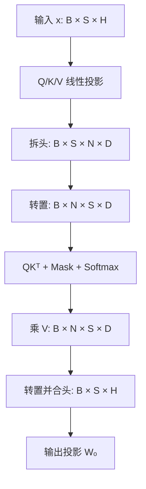
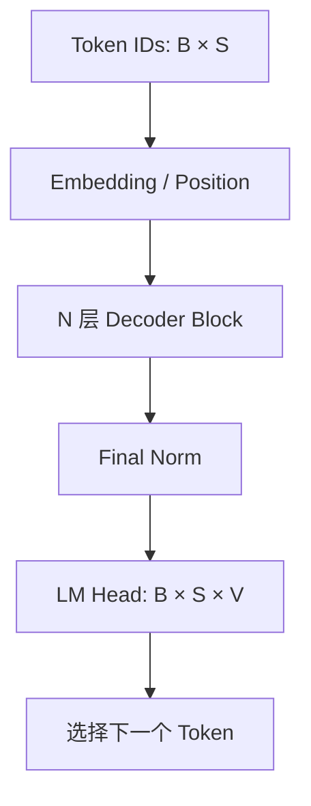

# 第 1 章补充｜读懂 Transformer 代码所需的 PyTorch 基础

> 对照材料：[Happy-LLM 第二章：Transformer 架构](https://github.com/datawhalechina/happy-llm/blob/main/docs/chapter2/%E7%AC%AC%E4%BA%8C%E7%AB%A0%20Transformer%E6%9E%B6%E6%9E%84.md)  
> 本文定位：不是重写 Transformer 教材，而是帮助零基础学习者**读懂其中的 PyTorch 代码，并建立算子开发最重要的 Shape 意识**。

---

## 1. 学完这一篇，你应该能做到什么？

读 Happy-LLM 第二章时，最容易卡住的通常不是注意力公式，而是这些代码问题：

- `query.size(-1)` 中的 `-1` 是什么意思？
- `view`、`transpose`、`contiguous` 为什么总是连在一起？
- `torch.matmul` 如何自动完成一批矩阵乘法？
- `scores.softmax(dim=-1)` 究竟沿哪个维度计算？
- 为什么一个普通张量要用 `nn.Parameter` 或 `register_buffer` 注册？
- `nn.ModuleList` 和普通 Python `list` 有什么区别？
- `[B, S, H]` 为什么会变成 `[B, N, S, D]`？

学完后，你应当能够：

1. 读懂第二章代码使用的主要 Python 与 PyTorch 语法；
2. 给 Attention 每一步标出输入、输出 Shape；
3. 说清多头拆分、转置、合并的原因；
4. 理解 Mask、Softmax、LayerNorm、MLP 和残差连接在代码中的位置；
5. 识别教材示例中的简化假设，不把教学代码直接等同于工程实现；
6. 看懂这些代码与后续 FA/FIA 算子学习之间的关系。

推荐配套实验：[pytorch_transformer_shapes.ipynb](../../examples/ch01/pytorch_transformer_shapes.ipynb)（逐格运行）；[pytorch_transformer_shapes.py](../../examples/ch01/pytorch_transformer_shapes.py) 保留为完整脚本参考。

---

## 2. 先统一 Shape 符号

在算子学习中，先问“张量是什么形状”，再问“代码是什么意思”。

| 符号 | 含义 | 示例 |
| --- | --- | --- |
| `B` | Batch size，一批有多少条序列 | `2` |
| `S` | Sequence length，序列长度 | `128` |
| `H` | Hidden size，模型隐藏维度 | `4096` |
| `N` | Number of heads，注意力头数 | `32` |
| `D` | Head dimension，每个头的维度 | `128` |
| `V` | Vocabulary size，词表大小 | `32000` |
| `S_q` | Query 序列长度 | Prefill 时可能为 `128`，Decode 时通常为 `1` |
| `S_kv` | Key/Value 序列长度 | Decode 时包含历史 KV，可能远大于 `S_q` |

标准多头注意力通常满足：

$$
H=N\times D
$$

例如 `H=4096, N=32`，则 `D=128`。

> Happy-LLM 代码中使用了 `T`、`dim`、`n_embd`、`head_dim` 等名字。本文统一映射成 `B/S/H/N/D`，方便后面衔接 FIA。

---

## 3. PyTorch 基础：只学本章真正用到的部分

### 3.1 Tensor：多维数组，也是算子的输入输出

```python
import torch

x = torch.randn(2, 4, 8)
print(x.shape)       # torch.Size([2, 4, 8])
print(x.size())      # torch.Size([2, 4, 8])
print(x.size(-1))    # 8
print(x.dtype)       # 例如 torch.float32
print(x.device)      # 例如 cpu 或 cuda:0
print(x.numel())     # 2 * 4 * 8 = 64
```

这里可以把 `x` 理解为 `[B,S,H]=[2,4,8]`：

- `x.size(0)` 是 `B`；
- `x.size(1)` 是 `S`；
- `x.size(2)` 与 `x.size(-1)` 都是 `H`；
- 负数下标从末尾向前数，`-1` 表示最后一维，`-2` 表示倒数第二维。

### 3.2 解包 Shape

```python
B, S, H = x.shape
```

这叫做 Python 的序列解包。三维 Shape 正好被赋给三个变量。如果 `x` 不是三维张量，这行代码会报错，因此它也隐含了一个输入约束。

原文中的：

```python
bsz, seqlen, _ = q.shape
```

下划线 `_` 表示“这个值存在，但后面暂时不关心”。它并不是特殊关键字，只是一种约定。

### 3.3 索引与切片

假设 `x.shape == [B,S,H]`：

| 表达式 | 结果 Shape | 含义 |
| --- | --- | --- |
| `x[:, :3, :]` | `[B,3,H]` | 每条序列取前 3 个 token |
| `x[:, -1, :]` | `[B,H]` | 取最后一个 token，序列维消失 |
| `x[:, [-1], :]` | `[B,1,H]` | 取最后一个 token，并保留序列维 |
| `x[..., :4]` | `[B,S,4]` | `...` 代表前面所有维度 |

原文推理分支使用 `x[:, [-1], :]`，是为了让线性层输出保持 `[B,1,V]`，而不是变成 `[B,V]`。

### 3.4 `unsqueeze`：插入长度为 1 的维度

```python
position = torch.arange(0, S)   # [S]
position = position.unsqueeze(1) # [S, 1]
```

`[S]` 与 `[H/2]` 不能直接按目标方式组成位置编码；变成 `[S,1]` 后，可以与 `[H/2]` 广播相乘，得到 `[S,H/2]`。

另一个常见例子：

```python
pe = pe.unsqueeze(0)  # [S,H] -> [1,S,H]
```

新增的 batch 维为 1，随后可广播到任意 `B`。

### 3.5 `view` / `reshape`：改变看法，不改变元素数量

```python
x = torch.randn(B, S, H)
x_heads = x.view(B, S, N, D)
```

要求 `H == N*D`。变化前后元素总数相同：

$$
B\times S\times H=B\times S\times N\times D
$$

`view` 不负责“计算多头”，它只是把原来的隐藏维拆成 `N` 和 `D` 两维。

两者的实用区别：

- `view` 通常要求当前内存布局与目标 Shape 兼容；
- `reshape` 会尽量返回 view，不兼容时可能复制数据；
- 写高性能算子时不能只看 Shape，还要关注 stride 和内存是否连续。

### 3.6 `transpose`：交换两个维度

```python
x_heads = x_heads.transpose(1, 2)
# [B,S,N,D] -> [B,N,S,D]
```

这里交换第 1 维和第 2 维。这样每个 batch、每个 head 都拥有一个 `[S,D]` 矩阵，便于执行注意力矩阵乘法。

`transpose` 一般只改变张量的 Shape/stride 视图，不会真的按照新顺序复制整块数据。因此结果往往是 non-contiguous。

### 3.7 为什么 `transpose(...).contiguous().view(...)` 总在一起？

多头结果为 `[B,N,S,D]`，合并头时需要：

```python
output = output.transpose(1, 2)  # [B,S,N,D]
output = output.contiguous()     # 按当前逻辑顺序整理内存
output = output.view(B, S, H)    # [B,S,N,D] -> [B,S,H]
```

关键点：

1. `transpose` 改了逻辑维度顺序；
2. 底层内存顺序通常没跟着变；
3. `view` 依赖兼容的内存布局；
4. `contiguous` 必要时创建连续副本，随后才能安全地 `view`。

这也是从 PyTorch 走向 AscendC 时很重要的意识：**Shape 相同不代表内存布局相同。**

### 3.8 `torch.matmul`：批量矩阵乘法

注意力中：

```python
scores = torch.matmul(q, k.transpose(-2, -1))
```

若：

- `q: [B,N,S_q,D]`
- `k: [B,N,S_kv,D]`
- `k.transpose(-2,-1): [B,N,D,S_kv]`

则最后两维执行矩阵乘法，前面的 `[B,N]` 是批量维：

$$
[B,N,S_q,D]\times[B,N,D,S_{kv}]
\rightarrow[B,N,S_q,S_{kv}]
$$

再与 `v: [B,N,S_kv,D]` 相乘：

$$
[B,N,S_q,S_{kv}]\times[B,N,S_{kv},D]
\rightarrow[B,N,S_q,D]
$$

### 3.9 广播 Broadcasting

广播允许长度为 1 的维度自动扩展。例如：

```python
scores = scores + mask
```

- `scores: [B,N,S,S]`
- `mask: [1,1,S,S]`

`mask` 的前两维会逻辑扩展到 `[B,N]`，因此一份 Mask 可供所有 batch 和 head 使用。

广播通常不需要真的复制 `B*N` 份数据，但算子实现仍需正确处理对应的 stride/寻址规则。

### 3.10 `softmax(dim=-1)`：沿 Key 位置归一化

```python
p_attn = scores.softmax(dim=-1)
```

`scores` 为 `[B,N,S_q,S_kv]`。`dim=-1` 表示每一个 Query 对所有 Key 的 `S_kv` 个分数做 Softmax，因此每一行权重之和为 1。

不要把它理解成“对整个张量做一次 Softmax”。它实际执行了 `B*N*S_q` 次长度为 `S_kv` 的 Softmax。

### 3.11 `float()` 与 `type_as()`：数值稳定和类型恢复

原文中有：

```python
scores = F.softmax(scores.float(), dim=-1).type_as(xq)
```

含义是：

1. `scores.float()` 临时转换为 FP32；
2. 用 FP32 计算 Softmax，提高数值稳定性；
3. `.type_as(xq)` 将结果转换回与 `xq` 相同的 dtype，例如 FP16/BF16。

这正是后续 Softmax/FIA 算子必须关注的问题：中间累加精度、溢出、下溢和最终输出类型。

---

## 4. `nn.Module`：怎样读懂一个 PyTorch 网络类？

### 4.1 最小结构

```python
import torch.nn as nn

class MyBlock(nn.Module):
    def __init__(self, hidden_size):
        super().__init__()
        self.proj = nn.Linear(hidden_size, hidden_size)

    def forward(self, x):
        return self.proj(x)
```

逐句理解：

| 语法 | 含义 |
| --- | --- |
| `class MyBlock(nn.Module)` | 继承 PyTorch 模块基类 |
| `__init__` | 创建层、参数和配置，只在实例化时执行 |
| `super().__init__()` | 初始化父类，使参数/子模块能被 PyTorch 正确登记 |
| `self.proj = ...` | 将线性层注册为当前模块的子模块 |
| `forward` | 定义一次前向计算的数据流 |
| `block(x)` | 推荐调用方式；PyTorch 会再调用 `forward` 并处理 hooks 等机制 |

原文中直接写 `self.attention.forward(...)` 能运行，但通常更推荐：

```python
self.attention(...)
```

### 4.2 `nn.Linear`

```python
linear = nn.Linear(in_features=H, out_features=N * D, bias=False)
y = linear(x)
```

如果 `x` 是 `[B,S,H]`，Linear 只变换最后一维：

$$
[B,S,H]\rightarrow[B,S,N\times D]
$$

其核心数学形式为：

$$
y=xW^T+b
$$

设置 `bias=False` 表示没有偏置项。

### 4.3 `nn.Embedding`

```python
embedding = nn.Embedding(num_embeddings=V, embedding_dim=H)
idx = torch.tensor([[5, 8, 2], [1, 9, 4]])  # [B,S]，整数 token id
x = embedding(idx)                           # [B,S,H]
```

Embedding 本质是从 `[V,H]` 的可训练表中按 token id 查行。

**重要纠正：**`nn.Embedding` 的典型输入是 `[B,S]`，不是 `[B,S,1]`。输出会在最后新增 `H` 维，成为 `[B,S,H]`。Happy-LLM 后面的完整 `forward` 也通过 `b,t = idx.size()` 表明 `idx` 是二维的。

### 4.4 `nn.Parameter`

```python
self.weight = nn.Parameter(torch.ones(H))
```

`Parameter` 会被登记为可训练参数：

- 出现在 `model.parameters()`；
- 通常会计算梯度；
- 优化器会更新它；
- 会进入 `state_dict`。

LayerNorm 中的缩放系数和偏置就是可训练参数。

### 4.5 `register_buffer`

```python
self.register_buffer("mask", mask)
```

Mask 和位置编码不是训练参数，但属于模型状态：

- 调用 `model.to(device)` 时会跟随模型移动；
- 默认进入 `state_dict`；
- 不会交给优化器更新。

因此它们比普通的 `self.mask = mask` 更适合作为模型固定状态。

### 4.6 `ModuleList` 与 `ModuleDict`

```python
self.layers = nn.ModuleList([Block(args) for _ in range(n_layers)])
self.parts = nn.ModuleDict({"encoder": Encoder(args), "decoder": Decoder(args)})
```

它们看起来像 Python 容器，但会将内部模块正确注册。若把层随意放进普通 `list/dict`，PyTorch 可能无法在参数遍历、保存、加载和设备迁移时发现它们。

### 4.7 `self.apply(...)`、`parameters()` 与 `numel()`

- `self.apply(fn)`：递归地对当前模块和所有子模块调用 `fn`；
- `self.parameters()`：遍历全部已注册参数；
- `p.numel()`：参数张量中的元素数量；
- `sum(p.numel() for p in self.parameters())`：统计模型参数总量。

### 4.8 `Dropout`

```python
self.dropout = nn.Dropout(p=0.1)
```

- 训练模式 `model.train()`：随机将部分元素置 0，并按规则缩放其余元素；
- 推理模式 `model.eval()`：不再随机丢弃元素。

所以同一输入在训练模式可能得到不同结果，推理模式应保持稳定。

---

## 5. 逐段解析 Happy-LLM 的 Attention 代码

### 5.1 单头/通用 Attention 函数

原文核心逻辑可拆成四步：

| 代码意图 | Shape 变化 | 数学含义 |
| --- | --- | --- |
| `d_k = query.size(-1)` | 取出 `D` | 缩放因子使用 Query/Key 维度 |
| `query @ key.transpose(-2,-1)` | `[...,S_q,D] @ [...,D,S_kv] -> [...,S_q,S_kv]` | 每个 Query 与每个 Key 做点积 |
| `softmax(dim=-1)` | Shape 不变 | 每个 Query 对全部 Key 得到概率分布 |
| `p_attn @ value` | `[...,S_q,S_kv] @ [...,S_kv,D_v] -> [...,S_q,D_v]` | 按注意力权重加权 Value |

完整公式：

$$
O=\operatorname{softmax}\left(\frac{QK^T}{\sqrt D}\right)V
$$

返回两个值：

```python
output, attention_weights = attention(q, k, v)
```

这是 Python 的元组返回与解包。`output` 是注意力输出，`attention_weights` 是 Softmax 后的权重。

一个容易误解的注释是“键向量维度和值向量维度相同”。严格来说：

- Q 与 K 的最后一维必须同为 `D`，才能计算点积；
- V 的序列长度必须与 K 的序列长度相同；
- V 的最后一维 `D_v` 可以与 `D` 不同。

### 5.2 `attention(x,x,x)` 为什么叫自注意力？

“自注意力”指 Q、K、V 来源于同一条序列，但工程实现通常不是直接把三个相同的 `x` 送进公式，而是先做不同线性投影：

$$
Q=xW_Q,\quad K=xW_K,\quad V=xW_V
$$

因此更准确的理解是：

```python
q = wq(x)
k = wk(x)
v = wv(x)
output = attention(q, k, v)
```

来源相同，但参数不同，扮演的角色也不同。

### 5.3 Causal Mask

长度为 4 的因果 Mask 是：

$$
M=\begin{bmatrix}
0 & -\infty & -\infty & -\infty \\
0 & 0 & -\infty & -\infty \\
0 & 0 & 0 & -\infty \\
0 & 0 & 0 & 0
\end{bmatrix}
$$

`torch.full(..., -inf)` 先填满负无穷，`torch.triu(..., diagonal=1)` 保留主对角线上方，其他位置变为 0。

将它加到 `scores` 后：

$$
e^{-\infty}=0
$$

所以 Softmax 后，未来位置权重严格为 0。Mask 不是删除未来 token，而是让这些位置在 Softmax 中没有贡献。

### 5.4 多头注意力的完整 Shape 流



逐步对应原文的 `MultiHeadAttention.forward`：

| 步骤 | Q 的 Shape | 解释 |
| --- | --- | --- |
| 输入 | `[B,S,H]` | 每个 token 一个隐藏向量 |
| `wq(q)` | `[B,S,N*D]` | 一次 Linear 同时生成全部头 |
| `view(B,S,N,D)` | `[B,S,N,D]` | 拆开 head 维 |
| `transpose(1,2)` | `[B,N,S,D]` | 将 head 放到矩阵维之前 |
| `Q @ Kᵀ` | `[B,N,S_q,S_kv]` | 每头独立算注意力分数 |
| `softmax` | `[B,N,S_q,S_kv]` | 对 `S_kv` 归一化 |
| `P @ V` | `[B,N,S_q,D]` | 加权汇聚 Value |
| `transpose(1,2)` | `[B,S_q,N,D]` | 把 token 维换回来 |
| `contiguous().view(...)` | `[B,S_q,H]` | 合并全部头 |
| `wo(output)` | `[B,S_q,H]` | 混合多头结果，回到残差流 |

### 5.5 为什么一个大 Linear 等价于 N 组头投影？

`nn.Linear(H, N*D)` 的权重可以看成 N 块 `[D,H]` 权重在输出维拼接。一次矩阵乘法同时计算 N 组投影，再通过 `view` 把结果解释成 N 个头。

这并不表示各头共用同一组参数；每一段输出对应的权重仍然不同。

### 5.6 教材版 MHA 对交叉注意力的一个简化

原文通过：

```python
bsz, seqlen, _ = q.shape
```

取得 Query 长度，后面却使用同一个 `seqlen` reshape K 和 V。这只适用于 `S_q == S_kv`。

通用写法应分别取得长度：

```python
B, S_q, _ = q.shape
_, S_kv, _ = k.shape

xq = self.wq(q).view(B, S_q, N, D).transpose(1, 2)
xk = self.wk(k).view(B, S_kv, N, D).transpose(1, 2)
xv = self.wv(v).view(B, S_kv, N, D).transpose(1, 2)
```

这个区别对 FIA 很关键：

- Prefill 自注意力常见 `S_q == S_kv`；
- Decode 时常见 `S_q=1`，但缓存后的 `S_kv` 很长；
- 交叉注意力也可能有 `S_q != S_kv`。

---

## 6. MLP、LayerNorm 与残差连接

### 6.1 MLP

原文 MLP 的数据流为：

$$
[B,S,H]\xrightarrow{W_1}[B,S,H_{ffn}]
\xrightarrow{ReLU}[B,S,H_{ffn}]
\xrightarrow{W_2}[B,S,H]
$$

Linear 始终只改变最后一维，前面的 `B,S` 保持不变。

教学代码把 `hidden_dim` 传成与 `dim` 相同，但实际 Transformer 的 FFN 中间维度通常会大于 `H`。现代 LLM 也常使用 GELU、SiLU/SwiGLU 等激活形式，而不一定是 ReLU。

### 6.2 LayerNorm

对于 `x:[B,S,H]`：

```python
mean = x.mean(-1, keepdim=True)  # [B,S,1]
```

`keepdim=True` 保留被归约的维度，方便 `[B,S,H] - [B,S,1]` 广播。

原文手写 LayerNorm 有助于理解，但与 `nn.LayerNorm` 的精确定义存在细节差异。更稳妥的教学实现是：

```python
mean = x.mean(dim=-1, keepdim=True)
var = x.var(dim=-1, keepdim=True, unbiased=False)
x_hat = (x - mean) * torch.rsqrt(var + eps)
return weight * x_hat + bias
```

差异包括：

- LayerNorm 使用总体方差，即 `unbiased=False`；
- `eps` 加在方差上、开平方之前；
- 原文直接使用默认 `std` 再加 `eps`，是概念近似而非完全复刻。

工程学习阶段可以直接使用：

```python
norm = nn.LayerNorm(H)
```

### 6.3 残差连接与 Pre-Norm

原文结构是：

$$
h=x+Attention(LayerNorm(x))
$$

$$
out=h+MLP(LayerNorm(h))
$$

这是 Pre-Norm：先归一化，再进入子层，最后与原输入相加。

相加要求两侧 Shape 完全一致，因此 Attention 和 MLP 最终都必须返回 `[B,S,H]`。

---

## 7. Encoder、Decoder 与现代大模型

### 7.1 教材中的结构

| 模块 | 注意力组成 | 典型用途 |
| --- | --- | --- |
| Encoder Layer | 双向自注意力 + MLP | 理解整个输入序列 |
| Decoder Layer | 因果自注意力 + 交叉注意力 + MLP | 根据历史输出和 Encoder 结果生成 |
| Decoder-only | 因果自注意力 + MLP | GPT、LLaMA 等生成式 LLM 常见主线 |

原文 Decoder 的两次注意力：

1. `mask_attention(norm_x, norm_x, norm_x)`：Decoder 内部因果自注意力；
2. `attention(norm_x, enc_out, enc_out)`：Q 来自 Decoder，K/V 来自 Encoder，属于交叉注意力。

### 7.2 为什么学习 FIA 时更关注 Decoder-only？

自回归 LLM 的核心推理循环通常来自 Decoder-only Transformer：



FIA 主要优化其中的注意力计算，不是整个 Transformer：

$$
QK^T\rightarrow Mask/Scale\rightarrow Softmax\rightarrow PV
$$

后续你看到的 GQA、PA、MLA、KV Cache、Prefill、Decode，都是围绕这条注意力主线改变 Q/K/V 的组织、存储或计算方式。

---

## 8. Embedding 与位置编码代码解析

### 8.1 Embedding 的正确输入输出

```python
idx = torch.tensor([[10, 25, 7]])  # [B,S]=[1,3]
tok_emb = embedding(idx)            # [B,S,H]
```

Token id 必须是整数类型（通常为 `torch.long`），每个 id 的范围应在 `[0,V-1]`。

### 8.2 正余弦位置编码

原文代码的关键 Shape：

| 变量 | Shape | 含义 |
| --- | --- | --- |
| `pe` | `[S_max,H]` | 全部位置的编码表 |
| `position` | `[S_max,1]` | 每个 token 的位置 |
| `div_term` | `[H/2]` | 不同维度的频率 |
| `position * div_term` | `[S_max,H/2]` | 通过广播得到每个位置、每种频率 |
| `pe.unsqueeze(0)` | `[1,S_max,H]` | 增加 batch 广播维 |

切片：

```python
self.pe[:, :x.size(1)]
```

表示只取当前输入实际长度 `S` 的位置编码，Shape 为 `[1,S,H]`，与 `x:[B,S,H]` 相加时沿 batch 广播。

因为 `pe` 已通过 `register_buffer` 注册，默认不参与梯度更新，通常不必在 `forward` 中再次调用 `.requires_grad_(False)`。

---

## 9. 完整 `Transformer.forward` 逐步读

### 9.1 输入

```python
b, t = idx.size()
```

这说明 `idx` 应为 `[B,S]`，而不是注释写的 `[B,S,1]`。

### 9.2 Embedding、Encoder、Decoder

| 操作 | 输出 Shape |
| --- | --- |
| `wte(idx)` | `[B,S,H]` |
| `wpe(tok_emb)` | `[B,S,H]` |
| `drop(pos_emb)` | `[B,S,H]` |
| `encoder(x)` | `[B,S,H]` |
| `decoder(x, enc_out)` | `[B,S,H]` |
| `lm_head(x)` | `[B,S,V]` |

### 9.3 训练分支

语言模型对每个 token 位置做一次 `V` 分类：

```python
logits = logits.view(-1, V)  # [B*S,V]
targets = targets.view(-1)   # [B*S]
loss = F.cross_entropy(logits, targets)
```

`-1` 表示让 PyTorch 根据总元素数自动推断这一维。

`logits` 是未归一化分数，不需要先手动 Softmax；`cross_entropy` 内部会完成对应的稳定计算。

### 9.4 推理分支

```python
last_hidden = x[:, [-1], :]  # [B,1,H]
logits = lm_head(last_hidden) # [B,1,V]
```

只计算最后一个位置的词表分数，因为自回归 Decode 当前只需要选择下一个 token。

但教材代码没有实现 KV Cache，因此每生成一个 token 都会重新计算全部历史。真正推理框架会缓存历史 K/V，这也是后续 FIA 学习的核心入口。

---

## 10. 教学代码中需要特别标记的简化与问题

以下不是说原文“不值得学”，而是帮助你区分概念代码与可复用工程代码。

| 位置 | 初学者可能形成的理解 | 更准确的理解 |
| --- | --- | --- |
| Embedding 输入 | 输入是 `[B,S,1]` | 通常是整数 id `[B,S]`，输出才是 `[B,S,H]` |
| `d_k` 注释 | K 和 V 最后一维必须相同 | Q/K 最后一维相同；K/V 序列长度相同；V 最后一维可不同 |
| `attention(x,x,x)` | Q/K/V 就是完全相同张量 | 自注意力来源相同，但一般经过不同的 Q/K/V 投影 |
| MHA reshape | Q、K、V 总是同一长度 | 通用注意力需分别处理 `S_q` 与 `S_kv` |
| `args.dim` 与 `args.n_embd` | 两者天然相同 | 示例混用了命名；应统一，或明确投影维度关系 |
| 手写 LayerNorm | 与官方层完全等价 | 方差定义与 eps 位置存在差异 |
| `.forward(...)` | 子模块通常直接这样调用 | 推荐 `module(...)`，让 PyTorch 调用链保持完整 |
| 完整 Transformer | 代表当前主流 LLM 结构 | 它是 Encoder-Decoder 教学拼装；主流生成式 LLM 多为 Decoder-only |
| 推理分支 | 已是高效推理 | 尚未加入 KV Cache、GQA、PA、MLA 或融合 Attention |

### 10.1 一个额外的代码一致性提醒

原文 `EncoderLayer` 片段存在缩进展示问题，复制后可能触发 `IndentationError`。学习时应把类内 docstring、`__init__`、`forward` 保持同一级缩进。

---

## 11. 从这些 PyTorch 代码走向 FA/FIA

PyTorch 代码描述“算什么”，算子代码还必须回答“怎么高效地算”。

| PyTorch 表达 | 算子视角的问题 |
| --- | --- |
| `Q @ K.transpose(-2,-1)` | 如何切块？是否将完整 `S_q×S_kv` 分数写回显存？ |
| `/ sqrt(D)` | Scale 在哪一步融合？使用什么精度？ |
| `scores + mask` | Mask 如何广播？是显式张量还是在线生成？ |
| `softmax(dim=-1)` | 如何做 max/sum 归约？怎样避免溢出？ |
| `P @ V` | 如何与前面的 Softmax 流水衔接？ |
| `transpose/view` | 实际数据布局、stride、搬运成本是什么？ |
| FP32 Softmax 再转回 | 中间计算精度、存储精度如何选择？ |

FlashAttention 的关键并不是改变最终数学结果，而是围绕片上存储对 Q/K/V 分块，在线维护 Softmax 统计量，减少大规模中间矩阵的外存读写。

因此这一篇最重要的学习成果不是背 API，而是养成四问：

1. 输入输出 Shape 是什么？
2. 哪些维度参与计算，哪些维度只是批量维？
3. 数据在内存里是否连续，是否需要搬运/转置？
4. 中间结果用什么 dtype，是否稳定？

---

## 12. 建议的阅读顺序

回到 Happy-LLM 第二章时，建议按下面顺序读，而不是一次从头读到底：

1. 先读 2.1.2，理解公式 `Softmax(QKᵀ/√D)V`；
2. 对照本文第 3、5 节，读 2.1.3 的 Attention 函数；
3. 对照 Shape 流程图，读 2.1.5～2.1.6 的 Mask 和 MHA；
4. 运行配套 Shape 实验，亲眼观察 `[B,S,H] -> [B,N,S,D]`；
5. 读 2.2.2～2.2.4，理解 MLP、LayerNorm、残差；
6. 读 2.2.5～2.2.6，但重点区分 Encoder-Decoder 与 Decoder-only；
7. 读 2.3.1～2.3.3，串起 token id、Embedding、Block、logits、loss；
8. 最后回看本文第 10、11 节，建立从 PyTorch 到 FIA 的接口。

---

## 13. 动手检查题

### 题 1

若 `B=2, S=16, H=64, N=8`，则 `D` 是多少？Q 拆头后的 Shape 是什么？

### 题 2

若 Decode 阶段 `Q:[2,8,1,8]`，KV Cache 中 `K:[2,8,128,8]`，则 `QKᵀ` 的 Shape 是什么？

### 题 3

为什么 `softmax(dim=-1)` 而不是 `dim=-2`？

### 题 4

为什么 `x[:,[-1],:]` 与 `x[:,-1,:]` 的结果 Shape 不同？

### 题 5

Mask 使用 `[1,1,S,S]` 而不是直接创建 `[B,N,S,S]`，依赖了 PyTorch 的什么机制？

<details>
<summary>展开参考答案</summary>

1. `D=H/N=8`；拆头并转置后为 `[2,8,16,8]`。
2. `[2,8,1,128]`。
3. 最后一维是 Key 位置，需要让每个 Query 对所有 Key 的权重和为 1。
4. 整数索引 `-1` 会消去该维；列表索引 `[-1]` 会保留一个长度为 1 的维度。
5. Broadcasting（广播）。

</details>

---

## 14. 参考资料

- [Happy-LLM：第二章 Transformer 架构](https://github.com/datawhalechina/happy-llm/blob/main/docs/chapter2/%E7%AC%AC%E4%BA%8C%E7%AB%A0%20Transformer%E6%9E%B6%E6%9E%84.md)
- [PyTorch 官方：Tensor Views](https://docs.pytorch.org/docs/stable/tensor_view.html)
- [PyTorch 官方：torch.Tensor.view](https://docs.pytorch.org/docs/stable/generated/torch.Tensor.view.html)
- [PyTorch 官方：torch.Tensor.contiguous](https://docs.pytorch.org/docs/stable/generated/torch.Tensor.contiguous.html)
- [PyTorch 官方：nn.Module](https://docs.pytorch.org/docs/stable/generated/torch.nn.Module.html)
- [PyTorch 官方：nn.Linear](https://docs.pytorch.org/docs/stable/generated/torch.nn.Linear.html)
- [PyTorch 官方：nn.Embedding](https://docs.pytorch.org/docs/stable/generated/torch.nn.Embedding.html)
- [PyTorch 官方：nn.MultiheadAttention](https://docs.pytorch.org/docs/stable/generated/torch.nn.MultiheadAttention.html)
- [PyTorch 官方：cross_entropy](https://docs.pytorch.org/docs/stable/generated/torch.nn.functional.cross_entropy.html)

下一步不需要急着读 AscendC。请先运行配套脚本，确保你能独立解释 MHA 中每一次 Shape 变化；这会直接决定后续能否看懂 tiling 和 kernel。
