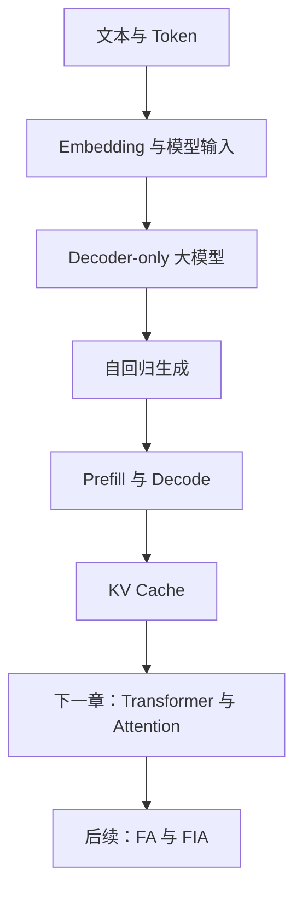
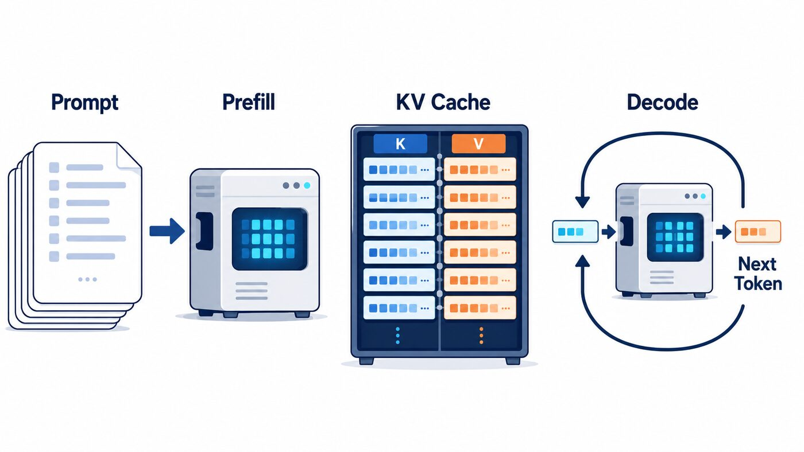
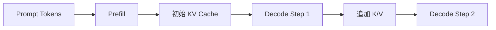
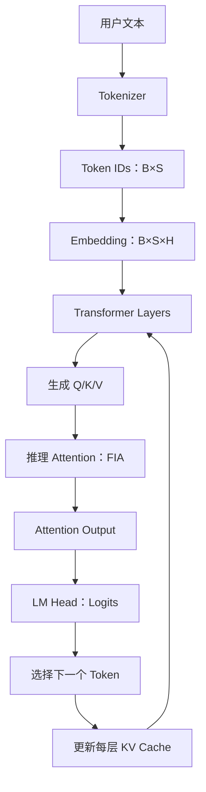

# 第 1 章｜大模型基础：从文本到逐 Token 推理

> 本章是一份面向 FA/FIA 算子学习者的中文导读。目标不是重新编写一本通用大模型教材，而是把 Token、Embedding、自回归生成、Prefill、Decode 和 KV Cache 串成一条能够继续进入 Transformer、FlashAttention 与 FIA 的知识链。

## 1. 本章在整个学习路线中的位置



后续学习 FIA 时，你会不断看到 `query`、`key`、`value`、`actualSeqLengths`、`numHeads`、`numKeyValueHeads`、`inputLayout`、`blockTable` 等参数。如果不知道一个 Token 是怎样走到 Q/K/V，也不知道 Prefill 和 Decode 为什么具有完全不同的 Shape 与性能特征，阅读 Tiling 和 Kernel 就只能停留在“辨认变量名”的层面。

本章只解决六个问题：

1. 大语言模型在做什么计算？
2. 文本怎样变成张量？
3. 模型怎样产生下一个 Token？
4. 为什么推理分成 Prefill 和 Decode？
5. 为什么需要 KV Cache？
6. 这些概念怎样映射到后续算子中的 Shape？

---

## 2. 推荐资料与使用方式

本章采用“成熟材料为主、FIA 视角补充”的方式组织。

| 层次 | 资料 | 本章使用范围 |
|---|---|---|
| 中文概念入口 | [Datawhale Happy-LLM](https://github.com/datawhalechina/happy-llm) | 选择性阅读“大语言模型”章节中的 LLM 定义、Decoder-only 与因果语言模型；训练和应用部分暂时跳过 |
| Token、Embedding 代码主线 | [LLMs-from-scratch](https://github.com/rasbt/LLMs-from-scratch) | Chapter 2 的文本处理、Token ID、Embedding；Chapter 5 的生成循环 |
| Prefill、Decode、KV Cache | [Hugging Face KV Cache 原理](https://github.com/huggingface/transformers/blob/main/docs/source/en/cache_explanation.md) | KV Cache 的动机、每层缓存、Shape 和更新过程 |
| KV Cache 工程补充 | [Hugging Face Cache 策略](https://github.com/huggingface/transformers/blob/main/docs/source/en/kv_cache.md) | Dynamic、Static、Offloaded、Quantized Cache，只建立概念，不要求掌握接口 |
| 现代完整代码补充 | [karpathy/nanochat](https://github.com/karpathy/nanochat) | 查看一个现代小型 LLM 如何把 Tokenizer、模型与带 Cache 的推理串起来，不要求第一遍逐行阅读 |
| 推理系统衔接 | [skyzh/tiny-llm](https://github.com/skyzh/tiny-llm) | 本章结束后了解 KV Cache、Decode、Tiled Prefill 如何继续走向推理系统 |

> 正在阅读 Happy-LLM 第二章但被代码语法卡住？请配合阅读 [补充篇：读懂 Transformer 代码所需的 PyTorch 基础](02-pytorch-transformer-code-guide.md)，并运行其中的 Shape 实验。

### 建议阅读顺序

1. 先完整阅读本章，形成总图。
2. 阅读 Happy-LLM 对应概念，解决中文术语问题。
3. 运行 LLMs-from-scratch Chapter 2 中与 Tokenizer、Embedding 有关的 Notebook。
4. 阅读 Hugging Face 的 KV Cache 原理文档。
5. 返回本章完成 Shape 和 KV Cache 显存练习。
6. 暂时不要直接深入 nanochat、tiny-llm 的完整工程；它们是后续源码参照物。

---

## 3. 大语言模型究竟是什么？

### 3.1 先理解“语言模型”

语言模型的核心任务可以表述为：给定已有 Token，估计下一个 Token 的概率分布。

例如输入：

```text
我正在学习 FA 算子，下一步应该学习
```

模型并不是直接“想出一句话”，而是计算词表中每个候选 Token 成为下一个 Token 的可能性：

```text
Transformer   0.31
Softmax       0.18
Attention     0.15
Python        0.04
……
```

如果选出了 `Transformer`，它会被追加到上下文，再预测后面的 Token。

用概率表示：

\[
P(x_1,x_2,\ldots,x_T)
=\prod_{t=1}^{T}P(x_t\mid x_1,\ldots,x_{t-1})
\]

这里的 `x_t` 不是一个汉字或单词，而是 Token。

### 3.2 “大”体现在哪里？

“大语言模型”没有一个永远不变的参数量门槛。对于本学习路线，更有用的理解是：

- 它仍然是语言模型；
- 通常采用 Transformer 架构；
- 通常包含大量可学习参数；
- 在大规模 Token 数据上进行预训练；
- 可以通过同一套模型参数执行多种语言任务。

算子学习者要区分三类“大小”：

| 名称 | 示例 | 对运行的影响 |
|---|---|---|
| 参数量 | 7B、32B、70B | 决定权重存储量和主要矩阵乘规模 |
| 上下文长度 | 4K、32K、128K Token | 决定 Attention 和 KV Cache 的规模 |
| Batch/并发 | 同时处理多少请求或序列 | 决定吞吐、显存和调度方式 |

一个 7B 模型可能使用很长的上下文；一个 70B 模型也可能只处理短请求。参数量大不等于单次 Attention 的序列一定长。

### 3.3 参数、激活与缓存不是一回事

这是后续分析算子内存时必须分清的概念：

- **参数（Parameters）**：训练后固定的权重，例如 Q/K/V 投影矩阵。
- **激活（Activations）**：本次前向计算产生的中间张量，例如 Hidden State、Q、K、V。
- **KV Cache**：推理时跨 Decode 步骤保留的 K/V 激活。
- **Workspace**：某个算子一次执行过程中临时使用的工作空间。

例如，7B 参数模型如果使用 BF16，仅权重的理论存储量约为：

\[
7\times 10^9\times 2\ \text{Byte}\approx 14\ \text{GB}
\]

这还没有计算 KV Cache、临时激活、运行时和算子 Workspace。

---

## 4. 文本怎样变成模型输入？

### 4.1 Tokenizer

模型不能直接接收字符串。Tokenizer 会把文本拆成 Token，再映射到整数 ID。

```text
"我在学习FlashAttention"
        ↓ Tokenizer
["我", "在", "学习", "Flash", "Attention"]
        ↓ 词表映射
[1042, 93, 7821, 18452, 23310]
```

上面只是示意。真实结果取决于具体 Tokenizer，同一个词可能被拆成多个 Token，空格和标点也可能参与编码。

需要掌握的概念：

- **Vocabulary / 词表**：Token 与整数 ID 的映射集合。
- **Vocabulary Size，V**：词表大小。
- **Token ID**：某个 Token 在词表中的整数编号。
- **Special Token**：BOS、EOS、PAD 等具有特殊语义的 Token。
- **Sequence Length，S**：当前输入包含的 Token 数量。

### 4.2 Token 数量为什么影响性能？

算子看到的不是“这段文字有 1000 个汉字”，而是“这个输入有 S 个 Token”。

同样长度的文本，在不同 Tokenizer 下可能产生不同的 `S`。而 `S` 会直接影响：

- Attention 计算规模；
- KV Cache 长度；
- Prefill 耗时；
- 能否超过最大上下文长度；
- 后续 FIA 中的 Query 和 KV 序列长度。

因此，服务系统中的“输入长度”通常以 Token 数量度量。

### 4.3 批量输入的第一种 Shape

假设 Batch 中有 2 条输入，每条补齐到 5 个 Token：

```text
input_ids.shape = [B, S] = [2, 5]
```

示意：

```text
[
  [101, 205, 309, 410, 502],
  [118, 993, 701, PAD, PAD]
]
```

这时通常还需要 Attention Mask，用来区分有效 Token 与 Padding。

---

## 5. Embedding：从整数到向量

Token ID 只是索引，整数之间的数值距离没有语言语义。模型通过 Embedding Table 查询每个 Token 对应的向量。

假设：

```text
词表大小 V = 100000
隐藏维度 H = 4096
```

Embedding Table 可以看成：

```text
[V, H] = [100000, 4096]
```

输入：

```text
input_ids: [B, S]
```

查表后：

```text
hidden_states: [B, S, H]
```

例如：

```text
[2, 5] → Embedding → [2, 5, 4096]
```

这里的每一个 Token 已经变成一个长度为 `H` 的向量。

### 5.1 Embedding 和 Hidden State 的区别

- 第一层 Transformer 之前的向量通常来自 Token Embedding 和位置信息。
- 每经过一个 Transformer Layer，Token 对应的向量都会更新。
- 中间各层和最后一层的这些向量统称为 Hidden States。

它们的 Shape 可能都为 `[B,S,H]`，但数值和语义不同。

---

## 6. 后续阅读算子必须掌握的维度

| 符号 | 英文 | 含义 | 常见位置 |
|---|---|---|---|
| B | Batch Size | 一次处理的序列数量 | `[B,S]`、`[B,S,H]` |
| S | Sequence Length | Token 数量 | Prompt、Query、KV 长度 |
| H | Hidden Size | 每个 Token 的隐藏向量长度 | `[B,S,H]` |
| N | Number of Heads | Attention 头数 | `[B,N,S,D]` |
| D | Head Dimension | 每个头的维度 | 通常 `H=N×D` |
| V | Vocabulary Size | 词表大小 | Logits 最后一维 |
| L | Number of Layers | Transformer 层数 | KV Cache 按层保存 |

还要进一步区分：

- `Nq`：Query 头数；
- `Nkv`：Key/Value 头数；
- `Sq`：Query 序列长度；
- `Skv`：Key/Value 序列长度。

在普通 MHA 中常见：

```text
Nq = Nkv
```

在 GQA/MQA 中可能出现：

```text
Nq > Nkv
```

这会显著减少 KV Cache 大小，也是后续 FIA 支持 GQA 的原因之一。

### 6.1 Shape 和 Layout 不同

Shape 表示各维度长度，Layout 表示这些语义维度按照什么顺序组织。

同一批数据可能表示为：

```text
BNSD: [Batch, Head, Sequence, HeadDim]
BSND: [Batch, Sequence, Head, HeadDim]
BSH : [Batch, Sequence, Hidden]
```

数学含义可能相同，但物理访问方式和 Kernel 实现不同。后续 FIA 接口中的 `inputLayout` 就是在描述这个问题。

---

## 7. Decoder-only 与因果语言模型

### 7.1 三类 Transformer 模型

先建立最小区别：

| 类型 | 代表模型 | 典型用途 |
|---|---|---|
| Encoder-only | BERT | 文本理解、分类、表示学习 |
| Encoder-Decoder | T5 | 翻译、摘要等序列到序列任务 |
| Decoder-only | GPT、Llama、Qwen | 自回归文本生成 |

本学习路线主要关注 Decoder-only，因为现代生成式大模型和推理 Attention 优化主要围绕它展开。

### 7.2 Causal Language Modeling

Decoder-only 模型通常使用因果语言建模：位置 `t` 只能使用它左侧和当前位置的信息，不能看到未来 Token。

输入：

```text
[我, 在, 学习, FA]
```

训练目标相当于错开一位：

```text
看到 [我]             → 预测 [在]
看到 [我, 在]         → 预测 [学习]
看到 [我, 在, 学习]   → 预测 [FA]
```

模型通过 Causal Mask 禁止当前位置关注未来位置。Causal Mask 会在下一章 Attention 中详细解释。

### 7.3 训练和推理的差异

训练时，已知整段正确答案，可以并行计算多个位置的预测损失；推理时，未来 Token 尚不存在，只能生成一个，再把它加入上下文继续生成。

```text
训练：一次前向可同时得到多个位置的预测
推理：生成 Token 1 → 再生成 Token 2 → 再生成 Token 3
```

这就是自回归推理具有串行依赖的根本原因。

---

## 8. 从 Hidden State 到下一个 Token

Transformer 最后一层输出：

```text
hidden_states: [B, S, H]
```

语言模型头（LM Head）把每个位置的 `H` 维向量映射到词表大小 `V`：

```text
logits: [B, S, V]
```

生成下一个 Token 时，通常只取最后一个有效位置：

```text
next_token_logits: [B, V]
```

### 8.1 Logits 与概率

Logits 是未归一化分数。对词表维做 Softmax 后得到概率：

\[
P_i=\frac{e^{z_i}}{\sum_j e^{z_j}}
\]

然后可以采用：

- Greedy：选择概率最大的 Token；
- Sampling：按照概率随机采样；
- Temperature：调整概率分布尖锐程度；
- Top-K / Top-P：限制候选集合。

这些生成策略发生在 Attention 之后，不属于 FIA 的计算范围。本章只需要知道模型最终会选出一个新 Token。

### 8.2 极简生成循环

下面是概念代码，不是高性能实现：

```python
tokens = tokenizer.encode(prompt)

for _ in range(max_new_tokens):
    logits = model(tokens)          # [1, current_seq_len, vocab_size]
    next_logits = logits[:, -1, :]  # [1, vocab_size]
    next_token = next_logits.argmax(dim=-1)
    tokens = append(tokens, next_token)

    if next_token == eos_token_id:
        break
```

注意：这个简化版本每一步都把完整 `tokens` 重新传入模型，会重复计算历史 Token。KV Cache 正是为了解决这类重复计算。

---

## 9. Prefill 与 Decode

一次典型推理可以分为两个阶段。



图中左侧表示 Prompt 在 Prefill 阶段一次性进入模型；中间的 K/V 成对存储代表各层产生的 KV Cache；右侧表示 Decode 每次输入当前 Token、读取历史 KV，并输出下一个 Token。该图用于建立直觉，精确的张量 Shape 以本节后续公式为准。



### 9.1 Prefill

Prefill 是模型第一次处理完整 Prompt 的阶段。

假设 Prompt 长度为 1024：

```text
input_ids: [B, 1024]
```

每一层 Attention 大致产生：

```text
Q: [B, Nq, 1024, D]
K: [B, Nkv, 1024, D]
V: [B, Nkv, 1024, D]
```

这个阶段会：

- 处理整个 Prompt；
- 产生第一个输出 Token；
- 为每一层建立初始 KV Cache；
- 通常具有较大的矩阵乘和较高并行度。

### 9.2 Decode

Decode 是之后逐 Token 生成的阶段。

使用 KV Cache 时，单步只需要输入最新 Token：

```text
current_input_ids: [B, 1]
Q_current: [B, Nq, 1, D]
K_current: [B, Nkv, 1, D]
V_current: [B, Nkv, 1, D]
```

但当前 Query 必须关注全部历史 KV：

```text
K_cache: [B, Nkv, S_total, D]
V_cache: [B, Nkv, S_total, D]
```

每生成一个 Token：

```text
S_total = S_total + 1
```

### 9.3 对比

| 项目 | Prefill | Decode |
|---|---|---|
| 输入 Token | 完整 Prompt | 通常为 1 个新 Token |
| `Sq` | 通常较大 | 通常为 1，也可能为少量 Token |
| `Skv` | Prompt 长度 | 历史长度持续增长 |
| 并行度 | 较高 | 单请求单步并行度较低 |
| 常见瓶颈 | 通常更偏计算 | 通常更偏 KV 读取和内存带宽 |
| 用户指标 | 影响 TTFT | 影响 TPOT/每 Token 时延 |

“Prefill 计算密集、Decode 带宽密集”是常见经验，不是对所有 Shape、硬件和调度方式都绝对成立。真正判断瓶颈仍需 Profile。

### 9.4 它们怎样对应 FIA？

FIA 面向推理 Attention，需要同时表达：

```text
Prefill: Sq > 1，通常一次处理较长 Query
Decode : Sq = 1 或很小，读取较长 KV Cache
```

因此 FIA 代码中会出现大量根据 `Sq`、`Skv`、Layout、头数和特性选择 Tiling/Kernel 的逻辑。

---

## 10. KV Cache

### 10.1 为什么可以缓存 K/V？

假设已经处理 Token 1～1000，现在要生成 Token 1001。

下一步生成 Token 1002 时：

- Token 1～1000 对应的 K/V 不会因为 Token 1001 出现而改变；
- 新增的只是 Token 1001 对应的 K/V；
- 因此历史 K/V 可以保存并复用。

逻辑更新：

\[
K_{cache}\leftarrow concat(K_{cache},K_{current})
\]

\[
V_{cache}\leftarrow concat(V_{cache},V_{current})
\]

### 10.2 为什么通常不缓存 Q？

历史 Token 的输出在过去的步骤中已经计算完成。生成新 Token 时，需要的是当前 Query 与全部历史 Key 的相关性，再用对应 Value 汇总信息。

历史 Query 不会被下一步重新使用，所以通常没有像 K/V 一样跨 Decode 步骤保存的必要。

### 10.3 KV Cache 是按层保存的

Transformer 有 `L` 层，每一层都有独立的 Attention，也会产生各自的 K/V。

单层逻辑 Shape 通常可写为：

```text
K_cache[layer]: [B, Nkv, S, D]
V_cache[layer]: [B, Nkv, S, D]
```

整个模型的 KV Cache 显存近似为：

\[
Bytes_{KV}=2\times L\times B\times N_{kv}\times S\times D\times Bytes_{dtype}
\]

前面的 `2` 表示 K 和 V 两份缓存。

### 10.4 一个显存估算例子

假设：

```text
L    = 32
B    = 1
Nkv  = 8
S    = 4096
D    = 128
dtype = BF16 = 2 Byte
```

则：

\[
2\times32\times1\times8\times4096\times128\times2
=536870912\ \text{Byte}
\]

约为 512 MiB。

这只是一条序列的 KV Cache，不包括模型权重和其他内存。Batch、并发数或上下文长度增加时，KV Cache 会线性增长。

### 10.5 KV Cache 解决了什么，又带来了什么？

收益：

- 避免为历史 Token 重复计算 K/V；
- 显著降低自回归 Decode 的重复计算；
- 改善生成速度。

代价：

- 占用大量设备内存；
- 每一步都要读取越来越长的历史 K/V；
- 不同请求长度不同，内存管理复杂；
- 连续内存可能产生碎片和预留浪费；
- 长上下文下可能成为带宽瓶颈。

这自然引出了后续 FIA 特性：

| 特性 | 主要解决的问题 |
|---|---|
| GQA/MQA | 减少 `Nkv`，降低 KV Cache 容量和读取量 |
| Paged Attention | 使用分页方式管理不同请求的 KV Cache |
| KV Quantization | 用更低位宽保存 K/V |
| MLA | 使用低秩表示压缩 KV 相关信息 |
| Sliding/Sparse Attention | 减少实际访问的历史范围 |

---

## 11. 从 Prompt 到 FIA 的完整链路



需要注意：

- Tokenizer 和 Embedding 不属于 FIA；
- Q/K/V 投影通常也不属于 FIA 的核心 Attention 计算；
- FIA 消费 Q/K/V，完成推理侧融合 Attention；
- FIA 输出还要继续经过输出投影、残差和后续层；
- 最终 LM Head 才得到词表 Logits。

用一句话描述：

> FIA 位于 Transformer Layer 内部，承接上游生成的位置相关 Q/K/V，在 Prefill 或 Decode 场景中利用历史 KV 完成融合 Attention 计算。

---

## 12. 本章容易混淆的概念

### 12.1 Token 不等于汉字或单词

Token 是 Tokenizer 定义的基本单位。一个汉字可能是一个 Token，一个英文单词也可能被拆成多个 Token。

### 12.2 Token ID 不等于 Embedding

Token ID 是整数索引；Embedding 是通过查表得到的浮点向量。

### 12.3 Hidden State 不等于 Logits

Hidden State 的最后一维是 `H`；Logits 的最后一维是词表大小 `V`。

### 12.4 参数不等于 KV Cache

参数是训练得到的权重；KV Cache 是本次推理请求产生并保留的中间状态。

### 12.5 Prefill 不等于训练

Prefill 仍然属于推理，只是一次处理完整 Prompt；训练还包含标签、损失和反向传播。

### 12.6 FA 不等于 FIA

- FA 是 FlashAttention 算法及相关算子家族；
- FIA 是昇腾平台上基于 FA 思想构建的推理融合 Attention 算子；
- FIA 还要处理 KV Cache、Prefill/Decode、GQA、PA、量化等推理能力。

---

## 13. 本章最小结论

完成本章后，应当能用自己的话解释下面这段话：

> 大语言模型先将文本编码为 Token ID，再通过 Embedding 和多层 Decoder Transformer 得到 Hidden State。LM Head 把最后位置的 Hidden State 映射为词表 Logits，模型选择一个 Token 后继续下一轮生成。第一次处理完整 Prompt 称为 Prefill；之后逐 Token 生成称为 Decode。为了避免每一步重复计算历史 Token 的 K/V，每层都会维护 KV Cache。FIA 正是承接这种推理 Attention 场景的昇腾融合算子。

还应记住以下 Shape：

```text
input_ids      : [B, S]
hidden_states  : [B, S, H]
Q              : [B, Nq, Sq, D]
K/V            : [B, Nkv, Skv, D]
logits         : [B, S, V]
decode Q       : [B, Nq, 1, D]
KV cache/layer : [B, Nkv, S_total, D]
```

---

## 14. 练习

### 练习 1：Shape

已知：

```text
B = 2
S = 128
H = 4096
N = 32
```

回答：

1. `input_ids` 的 Shape 是什么？
2. `hidden_states` 的 Shape 是什么？
3. `D` 是多少？
4. 普通 MHA 的 Q Shape 是什么？

### 练习 2：Prefill 与 Decode

Prompt 长度为 2048，已生成 10 个新 Token。

回答：

1. Prefill 时 `Sq` 大约是多少？
2. 下一次单 Token Decode 时 `Sq` 是多少？
3. 此时可关注的历史 KV 长度大约是多少？

### 练习 3：KV Cache 显存

已知：

```text
L = 40
B = 1
Nkv = 8
S = 8192
D = 128
dtype = BF16
```

使用本章公式估算 KV Cache 大小。

### 练习 4：解释

用自己的话回答：

1. 为什么 KV Cache 只缓存 K/V，而通常不缓存历史 Q？
2. KV Cache 已经减少重复计算，为什么 Decode 仍可能很慢？
3. GQA 为什么可以减少 KV Cache？

<details>
<summary>参考答案</summary>

练习 1：

```text
input_ids     : [2, 128]
hidden_states : [2, 128, 4096]
D             : 4096 / 32 = 128
Q（BNSD）     : [2, 32, 128, 128]
```

练习 2：

```text
Prefill Sq = 2048
下一次 Decode Sq = 1
历史 KV 长度约为 2048 + 10 = 2058
```

练习 3：

\[
2\times40\times1\times8\times8192\times128\times2
=1342177280\ \text{Byte}
\]

约为 1.25 GiB。

练习 4：

1. 历史 Q 的输出已经计算完成；新一步只需要当前 Q 查询全部历史 K/V。
2. 每一步仍需读取持续增长的 KV Cache，可能受内存容量和带宽限制。
3. GQA 让多个 Query 头共享更少的 KV 头，降低 `Nkv`，KV Cache 大小随之下降。

</details>

---

## 15. 下一章预告

下一章进入 Transformer 与 Attention，重点解释：

1. 一个 Decoder Layer 的完整结构；
2. Q/K/V 是怎样从 Hidden State 产生的；
3. `QKᵀ → Scale → Mask → Softmax → PV`；
4. MHA、GQA、MQA 的关系；
5. RoPE、RMSNorm、Residual 和 MLP 在哪里；
6. 为什么 Attention 会产生长序列 IO 瓶颈。

只有完成这些内容，才进入 FlashAttention 的分块与 Online Softmax。
