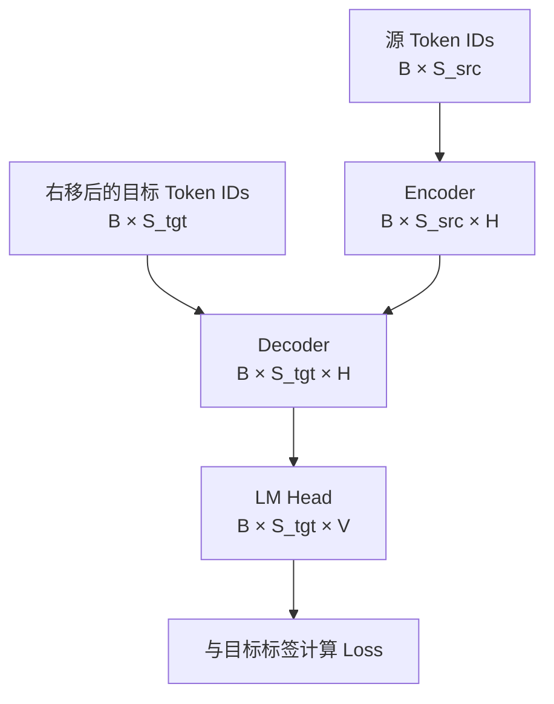
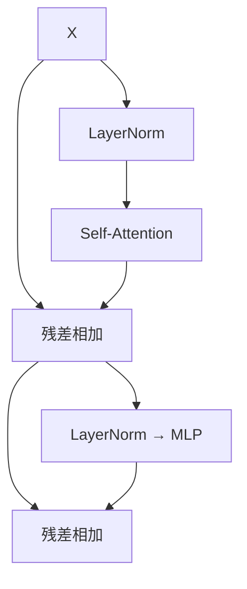
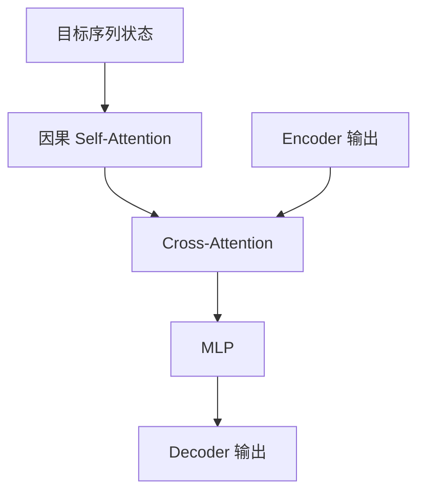

# 第 2 章｜从 Token 到 Loss：端到端读懂 Transformer 源码

> 这是一章可以独立阅读的 Transformer 源码课，不要求先看其他教材。配套实验：[transformer_end_to_end.ipynb](../../examples/ch02/transformer_end_to_end.ipynb)。Notebook 不依赖外部模型或数据集，直接运行即可。

## 0. 这一章解决什么问题

这一章不从 `MultiHeadAttention` 类开始逐行背代码，而是跟踪一次完整前向传播：

```text
源 Token IDs + 目标 Token IDs
→ Embedding
→ 位置编码
→ Encoder
→ Decoder 掩码自注意力
→ Decoder Cross-Attention
→ MLP、残差、LayerNorm
→ LM Head
→ Logits
→ Cross Entropy Loss
```

读完后，你应该能回答：

1. 图里的每个方框对应哪个类、哪次函数调用？
2. 每个公式对应哪几行代码？
3. 每一步的张量 Shape 为什么这样变化？
4. Encoder Self-Attention、Decoder Self-Attention、Cross-Attention 的 Q/K/V 分别来自哪里？
5. 哪几行是普通 Attention 的主体，之后会被 FA/FIA 融合实现替代？

---

## 1. 先明确：这里讲的是哪一种 Transformer

“Transformer”不是一个唯一结构。本章先讲原始的 Encoder–Decoder Transformer，因为它包含最完整的三种 Attention。

| 位置 | Attention | Q 的来源 | K/V 的来源 | 是否使用因果 Mask |
|---|---|---|---|---|
| Encoder | Self-Attention | Encoder 当前状态 | Encoder 当前状态 | 否 |
| Decoder 第一个子层 | Masked Self-Attention | Decoder 当前状态 | Decoder 当前状态 | 是 |
| Decoder 第二个子层 | Cross-Attention | Decoder 当前状态 | Encoder 输出 | 否 |

GPT、LLaMA 等 Decoder-only 大模型会删除 Encoder 和 Cross-Attention，保留带因果 Mask 的 Decoder Self-Attention。先理解完整结构，再切换到 Decoder-only，会比只记住若干类名更清楚。

---

## 2. 全局图：一次训练前向传播



统一记号：

| 符号 | 含义 | Notebook 示例 |
|---|---|---:|
| `B` | Batch Size | 2 |
| `S_src` | 源序列长度 | 6 |
| `S_tgt` | 目标序列长度 | 5 |
| `H` | 模型隐藏维度 | 8 |
| `N` | Attention 头数 | 2 |
| `D` | 每头维度，`D=H/N` | 4 |
| `V` | 词表大小 | 12 |
| `F` | MLP 中间维度 | 16 |

示例故意让 `S_src != S_tgt`。这样可以看清 Cross-Attention 的分数矩阵是 `[B,N,S_tgt,S_src]`，并不一定是方阵。

---

## 3. 第 0 步：为什么 Decoder 有“输入”和“标签”两份序列

假设希望 Decoder 学习生成：

```text
我 爱 FA EOS
```

训练时进行一次右移：

| 位置 | Decoder 输入 | 该位置的正确标签 |
|---:|---|---|
| 0 | BOS | 我 |
| 1 | 我 | 爱 |
| 2 | 爱 | FA |
| 3 | FA | EOS |

因此：

```python
tgt_in = [BOS, 我, 爱, FA]
labels = [我, 爱, FA, EOS]
```

模型一次并行输出所有位置的 Logits，但因果 Mask 保证位置 0 不能偷看位置 1～3。这就是“训练可以并行”和“不能看未来”同时成立的原因。

Notebook 使用整数 Token ID，不使用外部 Tokenizer。Tokenizer 只负责文本和 Token ID 之间的转换，不改变 Transformer 主体。

---

## 4. 第 1 步：Embedding 把 ID 变成向量

输入：

```text
src_ids: [B,S_src]
tgt_ids: [B,S_tgt]
```

Embedding 内部保存参数矩阵：

\[
E\in\mathbb{R}^{V\times H}
\]

Token ID 本质上是行号：

\[
X_{b,s}=E[\mathrm{token\_id}_{b,s}]
\]

代码：

```python
src_x = self.src_embedding(src_ids)  # [B,S_src] -> [B,S_src,H]
tgt_x = self.tgt_embedding(tgt_ids)  # [B,S_tgt] -> [B,S_tgt,H]
```

`nn.Embedding` 不是把整数乘上一个数，而是从 `[V,H]` 的可训练表中取出对应行。

---

## 5. 第 2 步：位置编码怎样与公式对应

纯 Self-Attention 对 Token 顺序没有天然感知，因此把位置向量加到 Token Embedding：

\[
X^{(0)}=Embedding(Token)+PE(Position)
\]

正余弦位置编码：

\[
PE(pos,2i)=\sin\left(pos\cdot10000^{-2i/H}\right)
\]

\[
PE(pos,2i+1)=\cos\left(pos\cdot10000^{-2i/H}\right)
\]

代码中的对应关系：

```python
position = torch.arange(max_len).unsqueeze(1)          # [max_len,1]
frequency = torch.exp(
    torch.arange(0, hidden_size, 2)
    * (-math.log(10000.0) / hidden_size)
)                                                     # [H/2]

pe[:, 0::2] = torch.sin(position * frequency)         # 偶数维
pe[:, 1::2] = torch.cos(position * frequency)         # 奇数维
```

`position * frequency` 通过广播得到 `[max_len,H/2]`。随后：

```python
x = x + pe[:, :x.size(1)]
```

Shape 不变：

```text
[B,S,H] + [1,S,H] -> [B,S,H]
```

---

## 6. 第 3 步：进入 Encoder Layer

本章使用目前大模型中常见的 Pre-Norm 写法：

\[
H_1=X+SelfAttention(LayerNorm(X))
\]

\[
Y=H_1+MLP(LayerNorm(H_1))
\]



代码骨架：

```python
norm_x = self.norm1(x)
attn_out, weights = self.self_attn(
    norm_x, norm_x, norm_x,
    key_padding_mask=src_valid,
)
x = x + attn_out
x = x + self.ffn(self.norm2(x))
```

关键点：

- 残差支路使用归一化前的 `x`；
- Q、K、V 的输入都来自 `norm_x`，所以叫 Self-Attention；
- Attention 和 MLP 最终都输出 `[B,S_src,H]`，才能与残差相加。

---

## 7. 深入 Encoder Self-Attention：公式、代码、Shape 一一对应

### 7.1 Q/K/V 投影

公式：

\[
Q=XW^Q,\quad K=XW^K,\quad V=XW^V
\]

代码：

```python
q = self.q_proj(query)
k = self.k_proj(key)
v = self.v_proj(value)
```

需要特别注意：函数参数 `query/key/value` 是投影前的 Hidden State；经过 `q_proj/k_proj/v_proj` 后的 `q/k/v` 才是公式中的 Q/K/V。

Encoder Self-Attention 中三者来源相同，但投影矩阵不同，所以数值并不相同。

### 7.2 拆头

\[
[B,S,H]\rightarrow[B,S,N,D]\rightarrow[B,N,S,D]
\]

```python
q = q.view(B, S_q, N, D).transpose(1, 2)
k = k.view(B, S_kv, N, D).transpose(1, 2)
v = v.view(B, S_kv, N, D).transpose(1, 2)
```

多头不是把 Token 分给不同头。每个头都能看到整段序列，被拆分的是每个 Token 的隐藏维度 `H=N×D`。

### 7.3 计算相似度

\[
Score=\frac{QK^T}{\sqrt D}
\]

```python
scores = q @ k.transpose(-2, -1)
scores = scores / math.sqrt(self.head_dim)
```

一般 Shape：

\[
[B,N,S_q,D]\times[B,N,D,S_{kv}]
\rightarrow[B,N,S_q,S_{kv}]
\]

Score 的倒数第二维是 Query 位置，最后一维是 Key 位置。

Encoder Self-Attention 中 `S_q=S_kv=S_src`：

```text
scores: [B,N,S_src,S_src] = [2,2,6,6]
```

### 7.4 Padding Mask

Batch 中较短句子会被 PAD 补齐。PAD 不能参与 Key/Value 汇聚：

```python
scores = scores.masked_fill(
    ~src_valid[:, None, None, :],
    float("-inf"),
)
```

`src_valid` 是 `[B,S_src]`，增加两个长度为 1 的维度后，广播到 `[B,N,S_q,S_src]`。

### 7.5 Softmax 与 Value 汇聚

\[
P=Softmax(Score)
\]

\[
Context=PV
\]

```python
weights = torch.softmax(scores.float(), dim=-1).to(q.dtype)
context = weights @ v
```

Softmax 沿 Key 维进行：每个 Query 对所有可见 Key 得到一组和为 1 的权重。

\[
[B,N,S_q,S_{kv}]\times[B,N,S_{kv},D]
\rightarrow[B,N,S_q,D]
\]

### 7.6 合头和输出投影

\[
MultiHead(Q,K,V)=Concat(head_1,\ldots,head_N)W^O
\]

```python
context = context.transpose(1, 2).contiguous()
context = context.view(B, S_q, H)
output = self.out_proj(context)
```

Shape 回到 `[B,S_q,H]`，因此可以进入残差连接。

---

## 8. 第 4 步：MLP 在做什么

Attention 在不同 Token 之间交换信息；MLP 对每个 Token 的向量独立进行非线性变换：

\[
MLP(x)=W_2\,GELU(W_1x+b_1)+b_2
\]

```python
self.net = nn.Sequential(
    nn.Linear(H, F),
    nn.GELU(),
    nn.Linear(F, H),
)
```

Shape：

```text
[B,S,H] -> [B,S,F] -> [B,S,H]
```

MLP 不改变 `B` 和 `S`，只改变最后的特征维。示例使用 `F=2H` 便于观察；经典 Transformer 常用 `F=4H`，现代 LLM 还常见 SwiGLU 等结构。

---

## 9. 第 5 步：进入 Decoder Layer

Decoder 比 Encoder 多一个 Attention：



Pre-Norm 公式：

\[
H_1=X+MaskedSelfAttention(LN(X))
\]

\[
H_2=H_1+CrossAttention(LN(H_1),EncoderOutput)
\]

\[
Y=H_2+MLP(LN(H_2))
\]

### 9.1 Decoder 因果 Self-Attention

```python
norm_x = self.norm1(x)
self_out, self_weights = self.self_attn(
    norm_x, norm_x, norm_x,
    attn_mask=causal_mask,
    key_padding_mask=tgt_valid,
)
x = x + self_out
```

因果 Mask：

\[
M=
\begin{bmatrix}
1&0&0&0&0\\
1&1&0&0&0\\
1&1&1&0&0\\
1&1&1&1&0\\
1&1&1&1&1
\end{bmatrix}
\]

其中 1 表示允许查看，0 表示遮住。代码用布尔下三角矩阵表示：

```python
causal_mask = torch.tril(
    torch.ones(S_tgt, S_tgt, dtype=torch.bool)
)
```

被遮位置在 Softmax 前填为 `-inf`，Softmax 后权重变成 0。

### 9.2 Cross-Attention

```python
norm_x = self.norm2(x)
cross_out, cross_weights = self.cross_attn(
    query=norm_x,
    key=encoder_output,
    value=encoder_output,
    key_padding_mask=src_valid,
)
x = x + cross_out
```

来源关系：

```text
Q   : Decoder 当前状态     [B,S_tgt,H]
K/V : Encoder 最终输出     [B,S_src,H]
```

拆头之后：

```text
Q   : [B,N,S_tgt,D] = [2,2,5,4]
K/V : [B,N,S_src,D] = [2,2,6,4]
```

所以：

```text
Cross-Attention Score: [B,N,S_tgt,S_src] = [2,2,5,6]
```

矩阵中的第 `i` 行表示目标位置 `i` 正在查询源序列的哪些位置；第 `j` 列表示源序列位置 `j` 被关注的程度。

---

## 10. 第 6 步：LM Head 从 Hidden State 得到 Logits

Decoder 输出：

```text
decoder_output: [B,S_tgt,H]
```

LM Head 是一个线性层：

\[
Logits=YW_{vocab}+b
\]

其中：

\[
W_{vocab}\in\mathbb{R}^{H\times V}
\]

代码：

```python
logits = self.lm_head(decoder_output)
```

Shape：

```text
[B,S_tgt,H] -> [B,S_tgt,V]
[2,5,8]     -> [2,5,12]
```

`logits[b,t,v]` 表示第 `b` 个样本、目标位置 `t` 上，词表 Token `v` 的未归一化分数。

---

## 11. 第 7 步：Logits 怎样变成 Loss

每个位置的标签是一个 Token ID：

```text
labels: [B,S_tgt]
```

交叉熵：

\[
Loss=-\frac{1}{M}\sum_{m=1}^{M}
\log Softmax(Logits_m)_{label_m}
\]

代码：

```python
loss = F.cross_entropy(
    logits.reshape(-1, vocab_size),
    labels.reshape(-1),
    ignore_index=PAD_ID,
)
```

reshape 后：

```text
logits: [B,S_tgt,V] -> [B×S_tgt,V]
labels: [B,S_tgt]   -> [B×S_tgt]
```

`cross_entropy` 内部已经包含 Log-Softmax，所以模型训练代码不需要提前对 Logits 调用 Softmax。`ignore_index=PAD_ID` 表示 Padding 位置不计入 Loss。

执行：

```python
loss.backward()
```

梯度会从 Loss 依次回传到 LM Head、Decoder、Encoder、位置相加结果和 Embedding 参数。这才完成一次完整的训练前向与反向传播。

---

## 12. 一次前向传播的完整 Shape 账本

Notebook 的实际输出应满足：

| 节点 | Shape |
|---|---|
| `src_ids` | `[2,6]` |
| `tgt_in` | `[2,5]` |
| 源 Embedding + PE | `[2,6,8]` |
| 目标 Embedding + PE | `[2,5,8]` |
| Encoder Self-Attention 权重 | `[2,2,6,6]` |
| Encoder 输出 | `[2,6,8]` |
| Decoder Self-Attention 权重 | `[2,2,5,5]` |
| Decoder Cross-Attention 权重 | `[2,2,5,6]` |
| Decoder 输出 | `[2,5,8]` |
| Logits | `[2,5,12]` |
| Labels | `[2,5]` |
| Loss | 标量 `[]` |

这张表比只看类定义更重要。源码中任何 `view`、`transpose`、矩阵乘或残差相加，都应该能在这张账本里解释。

---

## 13. 如何从入口阅读完整源码

建议顺序：

1. `TinyTransformer.forward`：先看完整数据流；
2. `EncoderLayer.forward`：看 Self-Attention 和 MLP 如何组成一层；
3. `DecoderLayer.forward`：看因果 Self-Attention 与 Cross-Attention；
4. `MultiHeadAttention.forward`：再深入 Q/K/V、拆头、Score、Softmax、PV；
5. `SinusoidalPositionEncoding`：理解位置怎样加入；
6. 最后看 `__init__`：确认模块和参数怎样注册。

不要先陷入 `register_buffer`、`contiguous` 或初始化细节。第一次阅读的目标是追踪数据和 Shape，第二次再处理 PyTorch 机制。

---

## 14. 为什么没有直接沿用 Happy-LLM 的 transformer.py

参考代码适合展示类名，但直接端到端运行会掩盖几个问题。本章 Notebook 已经修正：

| 原参考实现的问题 | 本章处理方式 |
|---|---|
| Encoder/Decoder 共用同一份 `x` | 分开 `src_ids` 与右移后的 `tgt_in` |
| Q/K/V 使用同一个 `seqlen` reshape | 分开读取 `S_q` 和 `S_kv` |
| 完整文件的 Pre-Norm 残差使用了归一化后的 `x` | 保留原始残差 `x + sublayer(norm(x))` |
| 没有 Padding Mask | Encoder、Decoder Self-Attention 和 Cross-Attention 均处理 PAD |
| 自定义 LayerNorm 与标准公式不完全一致 | 使用 `nn.LayerNorm` |
| `n_embd` 与 `dim` 两套名称容易混淆 | 统一为 `hidden_size=H` |
| 随机模型输出容易被误认为有效文本 | 明确只验证计算链、Shape、Loss 和梯度 |

因此本章不是给参考 Markdown 打补丁，而是重新建立一条完整、可执行、内部一致的学习主线。

---

## 15. 它怎样继续连接 Decoder-only、FA 和 FIA

在 Decoder-only 大模型里，可以先把本章结构简化为：

```text
Token IDs
→ Embedding / RoPE
→ N × Decoder Block
    → Causal Self-Attention
    → MLP
→ LM Head
→ Logits
```

FA/FIA 重点承接 Attention 内部：

```text
Q/K/V
→ QKᵀ
→ Scale
→ Mask
→ Softmax
→ P×V
→ Attention Output
```

普通 PyTorch 实现会显式产生：

```text
Score / Probability: [B,N,S_q,S_kv]
```

FA/FIA 的关键不是改变 Transformer 的数学结果，而是通过分块、融合和 Online Softmax，减少这个大中间矩阵对外部显存的读写。

在本章 Notebook 最后一节，可以修改 `S_q`、`S_kv`，估算 Score 张量的元素数和显存，为下一章学习 FlashAttention 做准备。

---

## 16. 本章练习

请在 Notebook 中依次修改：

1. 将 `S_src` 从 6 改为 7，确认只有 Encoder Self-Attention 和 Cross-Attention 的 Key 维变化；
2. 将 `S_tgt` 从 5 改为 4，确认 Decoder Self-Attention 变为 `[B,N,4,4]`，Cross-Attention 变为 `[B,N,4,S_src]`；
3. 打印因果 Mask 和 Decoder 第 0 个头的权重，确认主对角线上方为 0；
4. 去掉 Cross-Attention 的源 Padding Mask，观察 PAD 列是否可能出现非零权重；
5. 把 `num_heads` 从 2 改为 4，说明为什么 `head_dim` 从 4 变为 2，但合头后仍是 `H=8`。

完成后，应能不看答案写出：

```text
Q      : [B,N,S_q,D]
K/V    : [B,N,S_kv,D]
Score  : [B,N,S_q,S_kv]
Output : [B,S_q,H]
```

