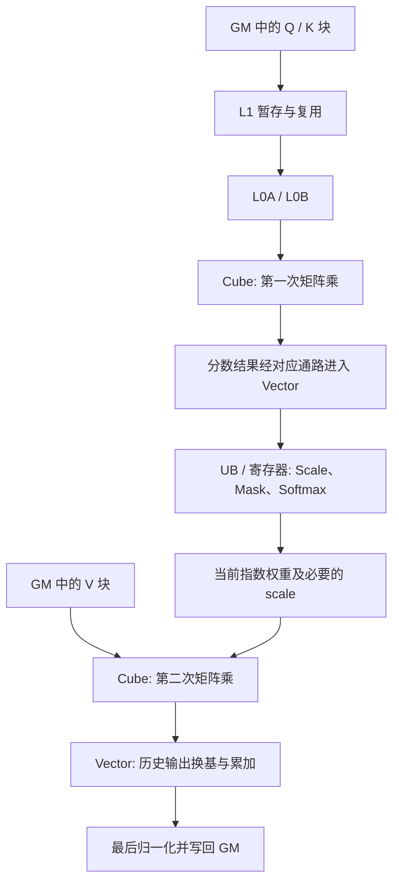

# 第 5 层：昇腾硬件、存储与流水

[概念目录](../README.md) · [项目 CANN 资料入口](../../references/cann-ascendc-guide.md)

这一层回答三个问题：数据放在哪里、谁执行计算、数据怎样送到计算单元。具体容量、核数、支持的搬运通路与指令随芯片和 CANN 版本变化；目前资料不足以确认实际开发机的型号与配置。

## 计算与控制单元

| 概念 | 职责 | Attention 中的例子 |
|---|---|---|
| AI Core | 执行 AI 计算的核心，内部结构依硬件代际而定 | 运行 Kernel 的主要计算任务 |
| AIC / AI Cube Core | 在 Cube/Vector 分离架构中，侧重矩阵计算的核 | QKᵀ、PV |
| AIV / AI Vector Core | 在分离架构中，侧重向量计算的核 | Scale、Mask、Softmax、量化、输出更新 |
| Cube | 矩阵计算单元 | 矩阵乘及累加；不是张量必须有三维 |
| Vector | 向量计算单元 | 逐元素运算和归约 |
| Scalar | 标量控制单元 | 下标、循环、分支、地址和指令控制 |
| MTE | 数据搬运相关执行单元 | 将当前计算块送入相应缓冲区 |
| AI CPU | 设备侧 CPU，可能执行辅助算子 | 某些实现的 metadata 准备；不等于 Host CPU |

AIC/AIV 与 Cube/Vector 有关联，但“核”和“核内计算单元”不是同一个层级。不要假设所有代际的比例、共享存储关系完全一致。

## 存储空间

| 名称 | 含义 | 常见存放内容 |
|---|---|---|
| GM / Global Memory | Kernel 可访问的全局存储空间 | 完整 Q/K/V、KV Cache、输出、workspace |
| HBM | 一种设备大容量内存硬件 | GM 数据的常见物理承载；GM 是编程层概念 |
| L1 Buffer | 矩阵通路的片上缓冲区 | 可复用的 Q/K/V 数据块 |
| L0A / L0B | Cube 的两路操作数缓冲区 | A、B 子矩阵 |
| L0C | 矩阵乘结果或累加缓冲区 | MMAD 结果 |
| UB / Unified Buffer | 向量路径的片上数据缓冲区 | 分数、指数、量化数据和统计量 |
| Vector Register | 向量执行时直接操作的寄存器 | VF 的载入、运算和存储中间值 |

L1 不应完全套用 CPU 自动缓存的模型；Ascend C 常显式组织搬运与同步。UB 的 Unified 也不意味着所有核共享一块无限大的内存。

## 用一个 Attention 数据块串起来

以下仅表示典型职责和依赖，省略格式转换及架构特定通路：

实际流水常同时处理不同块，不能据此认为同一个块的所有依赖都可以并行。

## VF、Tensor 与基础 API

| 名词 | 含义 |
|---|---|
| VF / Vector Function | 在当前寄存器编程语境中，组织向量加载、计算、存储的函数代码；不是新增硬件 |
| GlobalTensor | 对 GM 数据的编程表示 |
| LocalTensor | 对片上数据的编程表示；可能绑定 UB、L1、L0 等位置，不能一概等于 UB |
| DataCopy / LoadData | 搬运/装载数据；有长度、对齐、格式和存储位置约束 |
| Mmad | 矩阵乘累加相关原语；高层 Matmul 可组合装载和计算步骤 |
| Exp / ReduceMax / ReduceSum / Cast | 指数、最大值归约、求和归约和类型转换等基本操作 |
| Event / Wait / Barrier | 协调数据就绪、完成和可见性；具体同步范围要看 API |
| Queue / Pipe | 管理数据阶段、队列或流水资源的编程抽象 |
| Double Buffer / Ping-pong | 轮换两份缓冲区，让预取与当前计算交叠 |

缓冲区必须满足“写完才能读，读完才能覆盖”。双缓冲增大片上占用，也不能自动消除错误依赖。

## Softmax 高阶 API

SoftMax、SimpleSoftMax、SoftmaxFlash、SoftmaxFlashV2 是需按版本识别的 API 名称。团队说的“V1”通常指 SoftmaxFlash，应先确认签名。区别要逐项核查：

- 输出是归一化 P 还是未最终归一化的指数权重；
- 是否读取并更新历史 max/sum；
- 首块与后续块的模板参数；
- dtype、ND/NZ、尾块和临时空间要求。

本次已从学习快照的 arch22 调用和 arch35 显式 VF 实现核对在线更新思路，见[完整公式到代码](../03-attention/online-softmax.md)。官方旧链接未成功返回 API 正文，因此不把旧对话中的“所有版本都怎样”写成统一结论。

源码依据：[QBSA Matmul](https://gitcode.com/cann/ops-transformer/blob/1fe74acf0a60fea0ed143c3cda8054f6c373063f/experimental/attention/quant_block_sparse_attn/op_kernel/arch35/common/matmul.h)、[arch35 向量实现](https://gitcode.com/cann/ops-transformer/tree/1fe74acf0a60fea0ed143c3cda8054f6c373063f/attention/common/op_kernel/arch35/vf)。核利用率与等待的辨析见[性能页](../08-validation/performance-and-tests.md)。
