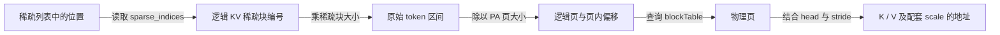

# 第 7 层：分页、稀疏与索引

[概念目录](../README.md) · [术语索引](../index.md) · [关联关系](../relations.md) · [量化精度](quantization.md)

最近补充：2026-09-14。对应问题：“什么叫 Page Attention？”“稀疏化是什么意思？”

**PA 决定 KV 存在哪里；稀疏选择决定计算哪些 KV；Tiling 决定怎样分批计算。** 这些配置可以组合使用。

<a id="paged-attention"></a>
## PagedAttention：把不断增长的 KV Cache 分页管理

Page Attention 通常指 **PagedAttention，简称 PA**。它把 KV Cache 分成固定大小的存储块，通过页表找到这些块，再读取其中的 K/V 完成 Attention。

Decode 每处理一个新 token，就会产生该 token 的新 K/V。PA 允许一条序列的历史 KV 分散在不同的物理页中，按需分配、释放，并为共享缓存提供条件，以减少大块预留、内存碎片和重复复制带来的浪费。[PagedAttention 原论文](https://arxiv.org/abs/2309.06180)

分页改变存放与寻址方式；在相同 Q/K/V、mask 和数值计算条件下，Attention 的目标数学结果不因物理页编号不同而改变。

### 10 个 token，每页存 4 个 token 的 K/V

以下为教学例子，省略 layer、head、D 和具体的 K/V 物理格式：

| 序列中的逻辑页 | 保存的内容 | 实际位置 |
|---|---|---|
| 第 0 页 | token 0～3 的 K/V | 物理页 7 |
| 第 1 页 | token 4～7 的 K/V | 物理页 2 |
| 第 2 页 | token 8～9 的 K/V，另有两个空位 | 物理页 10 |

```python
block_table[b] = [7, 2, 10]  # 第 b 条序列：逻辑页编号 → 物理页编号
```

Token 的逻辑顺序没有改变，物理页可以不连续。此时为 10 个有效 token 分配了 12 个槽位，末页有两个空位；分页不意味着每一页都恰好装满。下一 token 可以继续写入末页，末页写满之后再分配新页。未使用的槽位不能当作有效 KV 参与计算。

### 查找编号为 5 的 token

```python
token_index = 5              # 从 0 开始编号
page_size = 4

logical_page = token_index // page_size   # 逻辑页 1
offset_in_page = token_index % page_size  # 页内偏移 1
physical_page = block_table[b, logical_page]  # 物理页 2

# 读取物理页 2 中、偏移 1 的 K/V。
# 最终数据地址还需要 head、特征维度、dtype 和实际 stride。
```

通用的定位过程是：

```text
序列中的 token 位置
  → 整除页大小：逻辑页
  → 查 blockTable：物理页
  → 取余页大小：页内偏移
  → 结合具体 KV layout / stride 计算地址
```

页表保存的是逻辑页到物理页的映射，并不直接存储 Attention 权重。读取数据后仍需完成点积、Softmax 和 Value 汇总。[vLLM Paged Attention 实现说明](https://docs.vllm.ai/en/latest/design/paged_attention/)

### PA 相关名词

| 名词 | 含义 |
|---|---|
| Page / KV block | KV Cache 的分配、寻址单元 |
| Logical page | 某条序列中的页编号 |
| Physical page | 全局 KV 存储池中的实际页编号 |
| blockTable / block_table | 每个 batch 从逻辑页编号到物理页编号的映射 |
| pa_block_size | 一页容纳的 token 数 |
| PA_BNBD | 当前 QBSA 文档的分页 KV 布局名，实际 shape 为 [block_num,N2,pa_block_size,D] |
| cu_seqlens / seqused | 前缀边界或实际长度信息；具体含义、是否可省略按接口区分 |

PA_BNBD 中的 block_num 是物理页数，不能把它当普通 BNSD 的 batch。PA 页是 KV 存储组织单位，也不等于某个核在 UB/L1 中一次处理的计算 tile。

<a id="sparse-attention"></a>
## 稀疏化：减少参与 Attention 的 Query–Key 连接

在本学习场景里，稀疏化表示：**每个 Query 只关注选中的部分 KV 位置或块，跳过其余位置的计算。**

Dense Attention 对所有允许的位置计算；Sparse Attention 只计算其中选中的部分。“允许的位置”已经考虑 causal、padding 等规则，不能把未来 token 当作稠密因果 Attention 原本应该计算的对象。

### 从 8 个 KV 块中选 3 个

假设某个 Query 可以访问 8 个逻辑 KV 块，只保留其中的 0、3、7：

```text
KV 块编号：    0  1  2  3  4  5  6  7
稠密计算：    ✓  ✓  ✓  ✓  ✓  ✓  ✓  ✓
稀疏计算：    ✓  ·  ·  ✓  ·  ·  ·  ✓

✓ 参与计算    · 跳过
```

```python
sparse_indices = [0, 3, 7]  # 选中的逻辑 KV 块编号
sparse_seq_len = 3          # 有效索引数量，不是 token 数
```

在 QBSA 中，选择通常按 Query block 组织：一组 Query 行共享一个稀疏 KV 块清单，块内再按 mask 等规则处理合法元素。这里的列表是省略 batch/head/Query-block 轴的示意。

跳过位置的注意力权重视为 0，**不表示必须把原来的 K/V 数据清零或从缓存中删除**。同一份 K/V 仍可能被其他 Query 选中。

### 哪些块被保留？

| 策略 | 最小解释 |
|---|---|
| 局部窗口 | 主要保留附近的 token 或块 |
| 固定保留 | 始终保留某些起始位置或特殊位置 |
| 动态选择 | 根据打分，选择可能更重要的块 |
| 组合策略 | 固定块、局部窗口与动态选块一起使用 |

不同策略有不同效果和成本。得到完整稠密 Attention 后才把某些结果设为零，并不自动节省前面的计算；实现要能跳过相应运算或数据读取，才能获得对应收益。

### 选中后，Softmax 也要按同一集合归一化

令 I 是选中的有效 Key 位置集合，s_j 是对应 score：

$$
p_j=
\begin{cases}
\displaystyle\frac{\exp(s_j)}{\sum_{k\in I}\exp(s_k)}, & j\in I,\\
0, & j\notin I,
\end{cases}
\qquad O=\sum_{j\in I}p_jV_j.
$$

这是数学定义；实际计算仍应减最大值以保持稳定。对非空有效集合，所有保留位置的权重合计为 1。若 I 为空，则需要按算子无效行约定处理，不能直接套分母为零的公式。

例如某行稠密权重为 [0.1,0.2,0.3,0.4]，只保留第 1、3 项（下标从 0 开始）且 score 不变，则两者应重新归一化为 [1/3,2/3]，而不是直接保留 [0.2,0.4]。后者的权重和只有 0.6。

**相对同一个稠密目标，稀疏化通常改变输出**：部分 Value 的贡献被排除，保留位置的权重也变化了。普通稠密 FA 的分块则保持相同有效元素集合下的目标公式；两者应区分。[FlashAttention 论文中的块稀疏扩展](https://arxiv.org/abs/2205.14135)

### 稀疏相关名词

| 名词 | 含义 |
|---|---|
| Block Sparse | 以块为单位选择、跳过 KV 区域 |
| sparse_indices | 每个 Query 块保存的逻辑 KV 块编号列表 |
| sparse_seq_len | 当前 Query 块实际有效的索引数量 |
| Sparse density | 保留部分相对于候选总体的比例，必须说明按块还是按元素统计 |
| Empty sparse row | Query 块没有有效稀疏项，需要按接口处理输出与 LSE |
| Sink / Window / TopK blocks | 固定保留的起始块、局部窗口块、按得分选择的块；具体规则由选块算法定义 |

<a id="sparse-pa"></a>
## 稀疏 + PA：先确定算哪些，再找到它们在哪里

Sparse mapping 是这一条寻址链：



例如 sparse_indices 的第 1 项为 3，表示第 3 个逻辑 KV 稀疏块，不直接表示物理页 3。

换一组用于说明两种块大小不同的例子：稀疏块大小 128、PA 页大小 256，则该块起始 token 为 384，逻辑页为 1，页内偏移为 128。只有尺寸与对齐满足特定关系时，才能直接用 sparse_id 查页表；通用实现还需要处理块范围与页边界。

量化路径的数据和 scale 必须使用一致的逻辑索引映射，否则可能把一个块的数据乘上另一个块的缩放值，即使输出 shape 看起来正确，数值仍会出错。

## 与已有概念的区别

| 概念 | 主要回答的问题 |
|---|---|
| KV Cache | 历史哪些计算结果保存下来复用？ |
| PA / PagedAttention | 这些 K/V 怎样分页存放、怎样找到？ |
| 稀疏化 | 哪些 KV 参与本次计算？ |
| Tiling | 参与的计算怎样分批执行、分给哪些核？ |
| 量化 | 用什么数值格式、scale 和转换规则存储或计算？ |

### 四种“块”应分开记录

| 分块对象 | 解决的问题 | 本学习场景中的例子 |
|---|---|---|
| FA tile | 运算和片上容量 | 128 行 Q、512 列 KV 的预定义计算配置 |
| Sparse block | 选择哪些 token 对参与 | 按一个逻辑 KV 区间选中或跳过 |
| PA page | KV 的存储分配与寻址 | 一个物理页存若干 token |
| Quant group | 哪些元素共享 scale | MXFP8 每 32 个元素共用一个 E8M0 scale |

这些大小相等时也只是实现选择，不是定义上的相等。保留八分之一的块不能直接推出八倍加速：选块、搬运、scale、尾块和负载均衡仍有成本。

<a id="stem-indexer"></a>
## Stem Indexer 的上下游位置

本学习快照的 StemIndexer 根据 qflat/kflat 的块级相关性和 vbias 进行打分，再按动态 TopK 预算、Sink 与 Window 规则选择块，输出 sparse_indices 和 sparse_seq_len。QBSA 使用这些索引完成所选 KV 的 Attention。

qflat/kflat 是用于选块的压缩表示，vbias 是选块评分的 Value 量值偏置；它们不等于最终 Attention 的完整 Q/K/V 或 PV 输出。

这是具体算子接口的关系，不证明 FIA 内部一定调用 StemIndexer，也不意味着 Indexer 与 QBSA 采用相同 dtype。

源码：[StemIndexer 说明](https://gitcode.com/cann/ops-transformer/blob/1fe74acf0a60fea0ed143c3cda8054f6c373063f/experimental/attention/stem_indexer/docs/StemIndexer.md)、[QBSA-MX 接口](https://gitcode.com/cann/ops-transformer/blob/1fe74acf0a60fea0ed143c3cda8054f6c373063f/experimental/attention/quant_block_sparse_attn/docs/QuantBlockSparseAttnMx.md)。版本和读取范围见[来源清单](../sources.md)。
