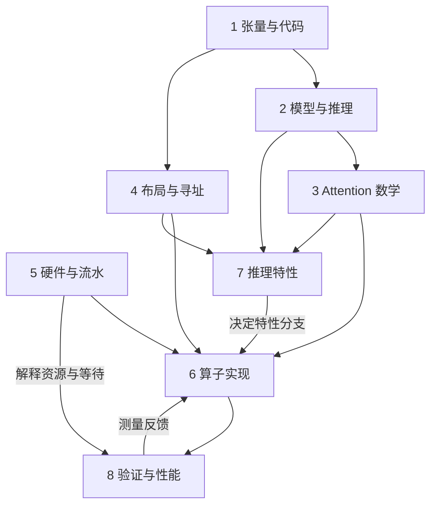
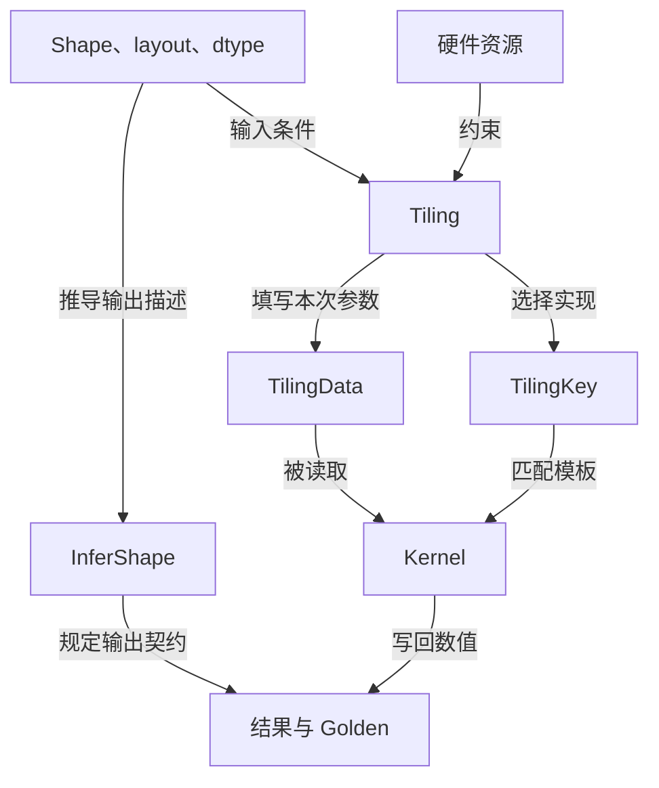

# FA / FIA 算子开发：知识网络与分层学习地图

[仓库首页](../../README.md) · [概念目录](README.md) · [全部术语索引](index.md)

整理日期：2026-09-14  
依据：学习仓库 `yywei0323/fa-learning-map`，读取快照 `c2dc9a21ea2982bbdbe9c6c60f2679fd41f25cc5`。  
用途：在已有八层概念库上增加学习依赖、分组顺序、关键连接和验收任务。本文是学习导航，配合原词条使用。

## 1. 当前材料与整理原则

仓库已有八层目录、概念关系页和 262 个术语索引项，并有张量/Transformer Notebook、在线 Softmax 详解、量化详解及布局扩展案例。最近讨论的 AIC/AIV、VF、BNS1 分核、Cube/Vector bound 均已入库。本次重点是把“查得到词”组织为“知道先学什么、为什么学、学到什么程度”。

- 一级：沿用原仓八个知识领域，便于与现有文件一一对应。
- 二级：每层拆成若干问题组，决定学习顺序。
- 三级：具体术语和可验证的小任务。
- 跨层：标注“前置知识、约束、产生、选择、执行、验证”等关系，不能把全部箭头理解为包含关系。
- 进度：已收录或已解释不等于已掌握；不根据聊天次数推断熟练度。

附件两个 txt 仅用于确认参考仓和笔记仓地址。本次直接读取学习仓当前内容；其来源页提到的历史本地源码、PR 快照及旧实验结果，仍属于仓库记录，本次未重跑 NPU 或重新验证 PR 状态。

原始入口：[八层目录](README.md) · [全部术语](index.md) · [已有关系图](relations.md) · [来源与版本](sources.md)

## 2. 知识网络总图

下面的箭头表达学习依赖，而非严格的软件调用顺序。特性层可在掌握相应前置后分支学习；验证习惯应从第一层开始。



| 层 | 核心问题 | 二级知识组 | 学习产出 |
|---|---|---|---|
| 1 张量与代码 | 怎么读懂数据和表达式？ | 张量描述；张量操作；PyTorch 模块；C++ 编译与参数 | 为几行 Attention 代码标注 shape 和轴 |
| 2 模型与推理 | 为什么会产生这次 Attention 计算？ | 文本编码；Decoder 结构；训练/生成；Prefill/Decode/缓存 | 画出一次生成的数据流 |
| 3 Attention 数学 | 输出怎么算，分块如何保持目标公式？ | QKV 与两次矩阵乘；Mask/Softmax；多头；FA/在线状态/LSE | 手算一行和两块合并 |
| 4 布局与寻址 | 同一个逻辑元素存在哪里？ | 轴语义；BNSD/BSND；TND/边界；stride/ND/NZ | 算出一个元素的偏移 |
| 5 硬件与流水 | 谁算、放哪里、如何搬运同步？ | 计算核与单元；存储；编程表示与 VF；同步与双缓冲 | 标注一个块的数据路径 |
| 6 算子实现 | 软件如何把公式交给硬件？ | 接口契约；Host 推导与 Tiling；Key/Data；任务调度；Kernel/Matmul | 跟踪一个字段从 Host 到 Kernel |
| 7 推理特性 | 哪个优化改变了哪一件事？ | 头共享/MLA；分页；稀疏；量化；具体算子边界 | 解释同一 case 的多种配置 |
| 8 验证与性能 | 怎样证明正确、够准、更快？ | 可复现环境；功能；精度；性能；综合回归 | 一份含输入、参考、结果和证据的 case 记录 |

## 3. 各层内部怎样学

### 第 1 层：张量与代码——先能读懂一个表达式

前置：基础变量、数组、循环；语言语法随代码补齐。

| 顺序 | 概念组 | 具体概念 | 过关问题 |
|---|---|---|---|
| 1.1 | 数据描述 | Tensor、Scalar、rank、shape、dtype、device、numel | [2,3,4] 有几条轴、多少元素、多少字节？ |
| 1.2 | 访问与计算 | 索引/切片、广播、matmul、elementwise、reduce、cast | 乘矩阵与逐元素乘有什么不同？Softmax 沿哪条轴归约？ |
| 1.3 | 轴变换 | reshape/view、transpose/permute、stride、contiguous、squeeze | 为什么换 S/N 不能直接随意 reshape？ |
| 1.4 | 模型代码 | Module、forward、Linear、Embedding、Parameter、buffer | 哪些是模型参数，哪些是本次输入和中间值？ |
| 1.5 | C++ 实现准备 | 指针/offset、struct/enum、namespace、template、if constexpr | 哪些值编译期确定，哪些值运行时传入？ |

训练相关 Autograd、backward、state_dict 等在端到端课程中按需学习；不必先背完框架 API 才进入 Attention。

练习：对 `Q @ K.transpose(-2,-1)` 和 `scores.softmax(dim=-1) @ V` 逐行标注输入/输出 shape。语法解释直接写在代码旁。

资料：[张量与代码](01-foundations/tensors-and-code.md) · [张量与多头 Notebook](../../examples/ch01/pytorch_transformer_shapes.ipynb)

### 第 2 层：模型与推理——找到 Attention 在整网的位置

前置：1.1、1.2；用小形状理解模型即可。

| 顺序 | 概念组 | 具体概念 | 过关问题 |
|---|---|---|---|
| 2.1 | 文本进入模型 | Tokenizer、Token ID、词表、Embedding、Hidden State | token ID 与 token 向量有什么区别？ |
| 2.2 | Decoder 内部 | QKV 投影、拆头合头、Attention、Wo、Residual、Norm、MLP | Q/K/V 从哪里来？Attention 输出为什么还要输出投影？ |
| 2.3 | 输出与生成 | LM Head、logits、采样、EOS、自回归 | Attention 权重与词表概率有什么不同？ |
| 2.4 | 推理阶段 | Prefill、Decode、KV Cache | 普通单 token Decode 中 Sq 很小，为什么 Skv 仍然很大？ |
| 2.5 | 后续扩展 | RoPE、RMSNorm、MoE；训练 Loss/反向传播 | 对照指定模型时再深入公式与代码 |

练习：固定 B=1、N=2、D=4，描述长度 3 的 prompt 预填充后，再输入一个新 token 时 Q/K/V 的长度。明确缓存含哪些层、哪些历史量。

资料：[模型与推理](02-model/transformer-and-inference.md) · [第 1 章导读](../01-llm-basics/README.md) · [端到端源码课](../02-transformer-end-to-end/README.md)

### 第 3 层：Attention 数学——从完整公式到分块状态

前置：矩阵乘、归约、QKV 来源；硬件基础可与 3.4 并行阅读。

| 顺序 | 概念组 | 具体概念 | 过关问题 |
|---|---|---|---|
| 3.1 | 一次 Attention | Q/K/V、B/N1/N2/S1/S2/D/Dv、score、BMM1、BMM2 | 一个 Query 的输出是标量还是向量？ |
| 3.2 | 有效位置与归一化 | softmax_scale、causal/padding mask、PSE、稳定 Softmax | Softmax 为什么沿 S2？全 mask 行为什么需单独约定？ |
| 3.3 | 头的组织 | MHA、GQA、MQA、G | Q 头怎样映射到 KV 头？ |
| 3.4 | FA 的目标 | IO-aware、fusion、tile、recompute、FA2 | 避免完整中间矩阵落 GM，与稀疏跳块有什么区别？ |
| 3.5 | 在线统计 | m、l、u、expMax/alpha、首块/更新块/末块 | 最大值变大时为什么 l 和 u 都要缩放？ |
| 3.6 | 统计的使用 | LSE、独立 KV 块合并 | LSE 是每行一个数，为什么不是直接对 Q 的 D 轴求和？ |

普通 MHA 教学形状：

```text
Q: [B,N,S1,D]     K: [B,N,S2,D]     V: [B,N,S2,Dv]
Score/P: [B,N,S1,S2]               O: [B,N,S1,Dv]
```

至少含一个有限有效分数的行，在线更新核心是：

```text
m_new = max(m_old, max(x_block))
alpha = exp(m_old - m_new)
e = exp(x_block - m_new)
l_new = alpha*l_old + sum(e)
u_new = alpha*u_old + e @ V_block
最终 O = u/l，LSE = m + ln(l)
```

先处理首块初始化；全 mask 行、空块需遵循接口约定。这里是实数数学模型，不代表低精度实现逐位一致。

练习：把 [1,2,3,4] 分成两块，比较“分别 Softmax 后拼接”与“累计 m/l/u”；解释错误来源，再查代码里的 expMax 消费位置。

资料：[Attention 与 FA](03-attention/attention-and-fa.md) · [在线 Softmax 详解](03-attention/online-softmax.md) · [LSE](03-attention/LSE.md) · [已有数学验证脚本](../../examples/concepts/verify_online_softmax.py)

### 第 4 层：布局与寻址——给公式里的元素找到地址

前置：1.3 与 3.1；这是阅读 Host、Kernel 的共同基础。

| 顺序 | 概念组 | 具体概念 | 过关问题 |
|---|---|---|---|
| 4.1 | 描述分工 | shape、layout、stride、dtype、offset | 哪个描述大小、轴语义、步长和数值类型？ |
| 4.2 | 固定轴排列 | BSH、BNSD、BSND、NTD | 同一个 b/n/s/d 在不同布局中怎样索引？ |
| 4.3 | 变长组织 | TND、packed、T、cu_seqlens、padding、有效长度 | T 为什么不能唯一确定每条序列的长度？ |
| 4.4 | 物理格式 | ND、NZ、格式转换、非连续张量 | ND/NZ 与 BNSD/BSND 是不是同一种分类？ |

连续存储时，元素偏移的教学式：

```text
BNSD: ((b*N+n)*S+s)*D+d
BSND: ((b*S+s)*N+n)*D+d
```

非连续张量按实际 stride；先算元素偏移，再结合 dtype 换算字节偏移。四维 shape 携带的 S 不自动等于有效长度；LSE 也有独立的输出轴约定。

练习：用 B=2、N=3、S=5、D=4 的非对称尺寸，算出同一逻辑元素的两种地址；说明变长 TND 打包时样本边界如何参与定位。

资料：[Layout](04-layout/layout.md) · [BNSD](04-layout/BNSD.md) · [BSND](04-layout/BSND.md) · [TND](04-layout/TND.md)

### 第 5 层：硬件与流水——分清计算、存储、代码抽象

前置：知道 QK 和 PV 是矩阵乘，Softmax 包含逐元素和归约操作。

| 顺序 | 概念组 | 具体概念 | 过关问题 |
|---|---|---|---|
| 5.1 | 计算和控制 | AI Core、AIC/AIV、Cube/Vector、Scalar、MTE、AI CPU | 核、计算单元、搬运单元分别是什么？ |
| 5.2 | 存储 | GM/HBM、L1、L0A/B/C、UB、向量寄存器 | 当前块的输入、累加、向量中间量放哪里？ |
| 5.3 | 代码表示 | GlobalTensor、LocalTensor、DataCopy/LoadData、Mmad、VF | VF 是函数还是硬件？LocalTensor 一定在 UB 吗？ |
| 5.4 | 协作 | Event、Wait、Barrier、Queue/Pipe、双缓冲 | 什么时候可读，什么时候可覆盖，哪些不同块可交叠？ |
| 5.5 | API 对照 | SoftMax、SimpleSoftMax、SoftmaxFlash/V2 | 当前版本接口返回的是 P 还是未最终归一化的权重？ |

AIC/AIV 的独立核解释限定于分离架构。缓冲容量、核数、比例、可用搬运通路以实际硬件为准。VF 主归属可放在实现层；硬件页收录它是为了说明寄存器编程与向量执行的关系。

练习：把一个 QK 块、Softmax、PV 块标上“存在哪里、谁计算、何时等待”。不要求先背完整芯片容量。

资料：[昇腾硬件与流水](05-hardware/ascend.md) · [项目指定硬件资料入口](../references/cann-ascendc-guide.md)

### 第 6 层：算子实现——从契约到选定的一条 Kernel 路径

前置：3 层数学、4 层地址、5 层资源，以及 C++ 模板基础。

| 顺序 | 概念组 | 具体概念 | 过关问题 |
|---|---|---|---|
| 6.1 | 调用与契约 | Framework、eager/Meta、算子原型、aclnn、Host/Device | 这次输入和输出遵守哪个接口？ |
| 6.2 | 描述推导 | InferShape、InferDataType、参数检查 | 输出 O 和 LSE 的形状在哪里确定？ |
| 6.3 | 执行计划 | Tiling、资源预算、blockDim、workspace | 算多大块、用多少核、尾块怎么处理？ |
| 6.4 | 计划传递 | TilingData、TilingKey、Config、metadata | Key 选谁、Data 传什么、metadata 描述哪些任务？ |
| 6.5 | 任务与循环 | BNS1/BN2GS1、Souter/Sinner、Query/KV tile、对齐、负载均衡、Split-KV | 拆 S1 与拆 S2 的结果合并有何不同？ |
| 6.6 | 局部实现 | Kernel、Matmul M/N/K、模板参数、MatmulBase/Full/K/N、MxMatmulFull、VF | 当前分支的装载、计算、同步、写回如何衔接？ |

职责表：

| 对象 | 最短描述 |
|---|---|
| InferShape | 输出尺寸 |
| Tiling | 执行方案 |
| TilingData | 本次执行参数 |
| TilingKey | 实现选择标识 |
| Kernel | 执行数值计算 |

BNS1 教学任务数为 `n_tasks = B*N1*ceil(S1/Br)`。任务数不是核数；稀疏和因果场景中，相同任务数也未必代表相同耗时。S2 跨核拆分要按统计量合并，不能直接相加各块归一化输出。

MatmulBase/Full 是特定 QBSA 源码中的函数职责；不作为所有 Matmul 库的统一定义。“ND 函数”仍需完整函数名才能归类。

练习：选一个实际 case，记录一项输入长度从 parser 到 Data 再到 Kernel 循环上界的路径；另记录一个 layout/量化开关如何影响 Key 与模板。先跟一条路径，不同时展开全部模板。

资料：[Host/Kernel](06-implementation/host-kernel.md) · [InferShape](06-implementation/InferShape.md) · [Tiling](06-implementation/Tiling.md) · [Data](06-implementation/TilingData.md) · [Key](06-implementation/TilingKey.md) · [分核与 Matmul](06-implementation/scheduling-and-matmul.md)

### 第 7 层：推理特性——按它改变的对象分支

前置不完全相同：PA 依赖缓存和寻址；Sparse 依赖有效位置与分块；Quant 依赖数值类型和参考结果。基础概念可在深入 Kernel 之前理解，实现细节再与第 6 层往返。

| 分支 | 子概念顺序 | 改变的对象 | 过关问题 |
|---|---|---|---|
| 7.1 头共享与表示 | MHA → GQA/MQA；之后 MLA | 头映射或缓存表示 | GQA 节省哪些 KV，MLA 为何不能直接套普通缓存公式？ |
| 7.2 分页 | KV Cache → 逻辑页/物理页 → page size → blockTable → 页内偏移 | 存储组织 | 给定 token 位置怎样找到物理页？ |
| 7.3 稀疏 | Dense → Block Sparse → sparse_indices/有效索引数 → sparse mapping → StemIndexer | 参与计算的集合 | 稀疏列表序号、逻辑块号、物理页号分别是什么？ |
| 7.4 量化 | 舍入/截断 → scale/descale → FP8 → MXFP8/E8M0 → 分组轴 → 误差 | 数值表示及执行路径 | FP32 累加为什么不能恢复输入量化丢失的信息？ |
| 7.5 算子定位 | Attention → FA 方法 → FIA/PFA/IFA 与 QBSA 等接口；Indexer 上游 | 接口与方法的关系 | FIA V3 为什么不是 FA3？ |

四种“块”必须单独列字段：计算 tile、稀疏 block、PA page、量化 group。它们可能大小相同，但职责不同。

四类 scale 也要分开：Attention 分数缩放；Q/K/V 量化或反量化尺度；P 路径尺度；在线更新 alpha。不能依据变量名 scale 就断定功能。

练习：选中稀疏块号 3，设稀疏块大小 128、PA 页大小 256：起点 token=384，逻辑页=1，页内偏移=128，再查 blockTable。随后解释 scale 为什么必须映射到同一份逻辑数据。此例只演示起点，跨页区间还需继续分段。

补充练习（2026-09-14）：

1. [PA 入门](07-features/paging-sparsity.md#paged-attention)：10 个 token、每页 4 个、页表 [7,2,10]，定位 token 5，并说明剩余容量。
2. [稀疏化入门](07-features/paging-sparsity.md#sparse-attention)：8 个 KV 块只选 [0,3,7]，解释哪些连接被跳过；再把保留概率 [0.2,0.4] 重新归一化，说明为什么输出通常会改变。
3. [组合寻址](07-features/paging-sparsity.md#sparse-pa)：区分“未被某个 Query 选中”和“KV 已从缓存删除”，串起 sparse_indices 与 blockTable。

资料：[PA 分页](07-features/paging-sparsity.md#paged-attention) · [稀疏化](07-features/paging-sparsity.md#sparse-attention) · [量化与精度](07-features/quantization.md) · [算法与算子关系](07-features/operator-map.md)

### 第 8 层：验证与性能——让结论带证据

前置：简单数学验证可从第 1 层开始；硬件瓶颈分析需第 5、6 层。

| 顺序 | 概念组 | 具体概念 | 验收产物 |
|---|---|---|---|
| 8.1 | 可复现环境 | Linux/SSH、容器、CANN、torch_npu、驱动、commit、Build/CI | 版本、命令、输入配置和 seed |
| 8.2 | 功能正确性 | Golden、UT/ST、Fuzz、Debug、OOB、Race、Regression | shape、布局、边界、输出语义检查 |
| 8.3 | 数值精度 | atol/rtol、MaxAbs/RMSE/RelativeL2、NaN/Inf | 明确参考含义的误差报告 |
| 8.4 | 性能 | FLOPs/FLOP/s、带宽、时延/吞吐、warmup、profiling | 相同 case 的时间线和重复测量 |
| 8.5 | 瓶颈与综合案例 | Cube/Vector/Memory/同步受限、负载不均、布局回归 | 瓶颈假设、证据、修改与前后对照 |

“Vector 在等 scale”只描述现象：可能是搬运、缓冲复用、依赖，也可能是计算瓶颈。数据到达晚与 Vector 运算能力不足要分开查。

量化验证分两种参考：原始高精度输入用于衡量量化损失；相同量化值/scale/转换语义的参考用于检查实现。二者不能互相替代。

练习：先用仓库布局扩展案例，列出 eager/Meta、InferShape、Key/Data、Q/O/LSE/scale 地址与 Golden 中必须保持一致的约定；再进入实际 FIA V3 用例。

资料：[验证与性能](08-validation/performance-and-tests.md) · [布局扩展综合案例](08-validation/layout-case.md) · [原五阶段路线](../roadmap.md)

## 4. 优先连通的六条跨层关系

| 知识起点 | 连接过程 | 最终能解释的问题 |
|---|---|---|
| Shape、layout、stride | 轴解释 → InferShape；寻址参数 → Data；实现条件 → Key → Kernel | 为什么增加 BNSD 不能只改一个字符串？ |
| S1/S2 与 Softmax | 不同行独立；同一行不同列块共用归一化 → 在线状态 → Split-KV 合并 | 为什么 BNS1 易并行，拆 S2 要额外合并？ |
| QK/Softmax/PV | 数学步骤 → Cube/Vector → 存储与同步 → profiling | Cube bound 和 Vector bound 在限制哪一段？ |
| KV Cache | 逻辑 token → 页表 → 物理页；稀疏先选逻辑块再寻址 | PA 与 Sparse 为什么能组合？ |
| dtype 与 scale | FP8/MXFP8 → 分组轴与尺度地址 → Cast/累加 → Golden | shape 正确但结果错，为什么可能是 scale 映射错？ |
| 在线 m/l/u | expMax 修正历史 → 最终 O 与 LSE → 输出 shape/地址 | LSE 为什么需要自己核对布局？ |

第一条可进一步画成：



这张图不要求 InferShape 必须先于所有 Tiling 调用；它表达职责与信息依赖。

## 5. 建议你现在怎样推进

根据最近的问题，优先补足的连接是“张量轴 → 一个 Attention 块 → 硬件 → 执行计划 → 性能”。这只是学习顺序建议，不判定你已掌握或未掌握某一层。

| 次序 | 本次只聚焦一个问题 | 阅读 | 留下一项成果 |
|---|---|---|---|
| 1 | 一个 Query/head 的数据和输出在哪里？ | 1.1～1.3、3.1、4.1～4.3 | 一页 shape/索引对照 |
| 2 | 为什么分块后 Softmax 仍能算对？ | 3.2、3.5、3.6 | 两块 m/l/u 更新手算 |
| 3 | 一个块怎样在 AIC/AIV 间完成？ | 5.1～5.4 | 标注存储、计算和等待的数据流 |
| 4 | Host 怎样告诉 Kernel 做什么？ | 6.1～6.5 | 一个 case 的 Data/Key/任务对照表 |
| 5 | PA、Sparse、MXFP8 怎样一起工作？ | 7.2～7.4 | 数据与 scale 的同源寻址例子 |
| 6 | 怎样判断错误或瓶颈？ | 8.2～8.5 | 一份问题假设与验证方法记录 |

每次学习建议保持同一种形式：一个概念问题 → 一小段公式/图 → 一段带内联解释的代码 → 一个手算或实验 → 回到知识网络补关系。前四项可以分别做成小 Notebook；已有 Notebook 继续复用，不再另立一套重复主教材。

原五阶段路线仍作为实践里程碑：模型/FA → FIA 调用链 → 一条真实 V3 用例 → 特性分支 → API 深入。八层概念库是查阅与前置地图，两者不冲突。硬件基础和基础 API 应提前插入调用链学习；“API 深入”不意味着之前完全不接触 API。

## 6. 进度如何记录

| 等级 | 判断依据 |
|---|---|
| S0 已收录 | 在资料中见过、能找到定义 |
| S1 能解释 | 不看原文能说明作用，并区分相邻概念 |
| S2 能手算/定位 | 能算 shape、地址或更新式；能指出实际代码位置 |
| S3 有验证 | 在明确环境下运行案例，保存输入、参考和结果 |

S3 需注明“CPU 数学实验”还是“NPU 算子验证”；性能结论需再附实际测量。本文没有给各词自动打分，也没有将仓库历史 CPU 数学实验视作 NPU 通过。

| 主题 | 本轮材料中的记录状态 | 下一条可记录证据 |
|---|---|---|
| layout、InferShape、TilingData/Key、LSE | 已有详细词条，部分原词条仍标“待理解” | 一个形状/地址/字段实例 |
| AIC/AIV、VF、BNS1、bound | 对话解释并已入库 | 把它们对应到同一实际任务 |
| Online Softmax | 详解及历史 CPU 数学验证记录 | 自己复述更新并复现实验 |
| MXFP8 与布局 PR | 固定版本的说明与案例 | 目标版本的输入契约、测试证据 |
| FIA V3、MLA、SoftmaxFlash/V2 | 原仓列为待深入 | 真实 case 或指定 API 签名对照 |

## 7. 需要保留的待核对事项

- “ND 函数”：需要完整函数名和上下文，不能唯一解释为格式转换。
- “Vector 阻塞在 scale”：需要具体 case、时间线和等待对象。
- 实际开发机型号、核数、片上容量：仓库尚未确认，编译参数不足以证明实机配置。
- QBSA-MXFP8 基线与 BNSD/BSND 扩展 PR：分别保留版本，不把旧 PR 快照当作当前合入状态。
- SoftmaxFlash/V2：按目标 CANN 版本和具体重载核对输出语义。
- FIA V3：未找到本次新增的上板验收证据，不能标记已调通。

资料：[原仓待核对项](open-questions.md)。原词条含 2026-09-10、2026-09-14 不同核查日期，应连同固定源码版本阅读。

## 附录：原仓 262 个术语索引的完整导航

保留原仓八个领域和全部索引项，便于核对覆盖；仓内链接使用相对路径，随当前阅读分支打开；整理依据的快照见文首。下方是导航，不重复复制所有定义。上文的二级分组决定学习顺序，附录用于按词查找。

### 1. 张量与代码

| 术语 / 别名 | 解释所在页 |
|---|---|
| Tensor | [查看解释](01-foundations/tensors-and-code.md) |
| Scalar | [查看解释](01-foundations/tensors-and-code.md) |
| Rank | [查看解释](01-foundations/tensors-and-code.md) |
| Shape | [查看解释](01-foundations/tensors-and-code.md) |
| dtype | [查看解释](01-foundations/tensors-and-code.md) |
| device | [查看解释](01-foundations/tensors-and-code.md) |
| numel | [查看解释](01-foundations/tensors-and-code.md) |
| stride | [查看解释](01-foundations/tensors-and-code.md) |
| Contiguous | [查看解释](01-foundations/tensors-and-code.md) |
| Index / Slice | [查看解释](01-foundations/tensors-and-code.md) |
| Broadcasting | [查看解释](01-foundations/tensors-and-code.md) |
| view / reshape | [查看解释](01-foundations/tensors-and-code.md) |
| transpose / permute | [查看解释](01-foundations/tensors-and-code.md) |
| unsqueeze / squeeze | [查看解释](01-foundations/tensors-and-code.md) |
| matmul / @ | [查看解释](01-foundations/tensors-and-code.md) |
| Elementwise | [查看解释](01-foundations/tensors-and-code.md) |
| Reduce | [查看解释](01-foundations/tensors-and-code.md) |
| Cast | [查看解释](01-foundations/tensors-and-code.md) |
| nn.Module / forward / __init__ | [查看解释](01-foundations/tensors-and-code.md) |
| nn.Parameter | [查看解释](01-foundations/tensors-and-code.md) |
| register_buffer | [查看解释](01-foundations/tensors-and-code.md) |
| ModuleList / ModuleDict | [查看解释](01-foundations/tensors-and-code.md) |
| nn.Embedding | [查看解释](01-foundations/tensors-and-code.md) |
| nn.Linear | [查看解释](01-foundations/tensors-and-code.md) |
| Autograd / backward / grad | [查看解释](01-foundations/tensors-and-code.md) |
| train / eval | [查看解释](01-foundations/tensors-and-code.md) |
| no_grad / inference_mode | [查看解释](01-foundations/tensors-and-code.md) |
| state_dict | [查看解释](01-foundations/tensors-and-code.md) |
| Compile time / Runtime | [查看解释](01-foundations/tensors-and-code.md) |
| Template | [查看解释](01-foundations/tensors-and-code.md) |
| if constexpr | [查看解释](01-foundations/tensors-and-code.md) |
| struct / enum | [查看解释](01-foundations/tensors-and-code.md) |
| Pointer / Offset | [查看解释](01-foundations/tensors-and-code.md) |
| Namespace / Header / Macro | [查看解释](01-foundations/tensors-and-code.md) |
| CMake | [查看解释](01-foundations/tensors-and-code.md) |
| Git Commit / Branch / PR | [查看解释](01-foundations/tensors-and-code.md) |
| Notebook | [查看解释](01-foundations/tensors-and-code.md) |

### 2. 模型与推理

| 术语 / 别名 | 解释所在页 |
|---|---|
| LLM / 语言模型 | [查看解释](02-model/transformer-and-inference.md) |
| Token / Tokenizer | [查看解释](02-model/transformer-and-inference.md) |
| Vocabulary / Token ID | [查看解释](02-model/transformer-and-inference.md) |
| Embedding | [查看解释](02-model/transformer-and-inference.md) |
| Hidden State / Activation | [查看解释](02-model/transformer-and-inference.md) |
| Parameter / Weight | [查看解释](02-model/transformer-and-inference.md) |
| Context length | [查看解释](02-model/transformer-and-inference.md) |
| Batch / 并发 | [查看解释](02-model/transformer-and-inference.md) |
| Encoder | [查看解释](02-model/transformer-and-inference.md) |
| Decoder | [查看解释](02-model/transformer-and-inference.md) |
| Decoder-only | [查看解释](02-model/transformer-and-inference.md) |
| Self-Attention | [查看解释](02-model/transformer-and-inference.md) |
| Cross-Attention | [查看解释](02-model/transformer-and-inference.md) |
| Q/K/V Projection / Wo | [查看解释](02-model/transformer-and-inference.md) |
| 拆头 / 合头 | [查看解释](02-model/transformer-and-inference.md) |
| Residual | [查看解释](02-model/transformer-and-inference.md) |
| Pre-Norm / Post-Norm | [查看解释](02-model/transformer-and-inference.md) |
| LayerNorm | [查看解释](02-model/transformer-and-inference.md) |
| RMSNorm | [查看解释](02-model/transformer-and-inference.md) |
| MLP / FFN | [查看解释](02-model/transformer-and-inference.md) |
| GELU / SiLU / ReLU | [查看解释](02-model/transformer-and-inference.md) |
| MoE | [查看解释](02-model/transformer-and-inference.md) |
| Positional Encoding | [查看解释](02-model/transformer-and-inference.md) |
| RoPE | [查看解释](02-model/transformer-and-inference.md) |
| Dropout | [查看解释](02-model/transformer-and-inference.md) |
| LM Head | [查看解释](02-model/transformer-and-inference.md) |
| Logits | [查看解释](02-model/transformer-and-inference.md) |
| Greedy / Sampling | [查看解释](02-model/transformer-and-inference.md) |
| Temperature / Top-k / Top-p | [查看解释](02-model/transformer-and-inference.md) |
| BOS / EOS / PAD | [查看解释](02-model/transformer-and-inference.md) |
| Teacher forcing / 右移标签 | [查看解释](02-model/transformer-and-inference.md) |
| Cross-entropy / Loss | [查看解释](02-model/transformer-and-inference.md) |
| Backpropagation / Optimizer | [查看解释](02-model/transformer-and-inference.md) |
| Training / Inference | [查看解释](02-model/transformer-and-inference.md) |
| Prefill | [查看解释](02-model/transformer-and-inference.md) |
| Decode | [查看解释](02-model/transformer-and-inference.md) |
| KV Cache | [查看解释](02-model/transformer-and-inference.md) |
| Dynamic / Static / Offloaded / Quantized Cache | [查看解释](02-model/transformer-and-inference.md) |

### 3. Attention 数学

| 术语 / 别名 | 解释所在页 |
|---|---|
| Attention | [查看解释](03-attention/attention-and-fa.md) |
| Q / K / V | [查看解释](03-attention/attention-and-fa.md) |
| B / N1 / N2 / H / D / Dv | [查看解释](03-attention/attention-and-fa.md) |
| S1 / Sq / S2 / Skv | [查看解释](03-attention/attention-and-fa.md) |
| Score / Attention Logit | [查看解释](03-attention/attention-and-fa.md) |
| BMM1 / MM1 | [查看解释](03-attention/attention-and-fa.md) |
| softmax_scale | [查看解释](03-attention/attention-and-fa.md) |
| Mask | [查看解释](03-attention/attention-and-fa.md) |
| Causal Mask | [查看解释](03-attention/attention-and-fa.md) |
| Padding Mask | [查看解释](03-attention/attention-and-fa.md) |
| PSE | [查看解释](03-attention/attention-and-fa.md) |
| Softmax | [查看解释](03-attention/attention-and-fa.md) |
| BMM2 / MM2 / PV | [查看解释](03-attention/attention-and-fa.md) |
| Attention Output | [查看解释](03-attention/attention-and-fa.md) |
| MHA | [查看解释](03-attention/attention-and-fa.md) |
| GQA / G | [查看解释](03-attention/attention-and-fa.md) |
| MQA | [查看解释](03-attention/attention-and-fa.md) |
| FA / FlashAttention | [查看解释](03-attention/attention-and-fa.md) |
| IO-aware | [查看解释](03-attention/attention-and-fa.md) |
| Fusion | [查看解释](03-attention/attention-and-fa.md) |
| Recompute | [查看解释](03-attention/attention-and-fa.md) |
| FA2 | [查看解释](03-attention/attention-and-fa.md) |
| Online Softmax | [查看解释](03-attention/online-softmax.md) |
| 行最大值 m | [查看解释](03-attention/online-softmax.md) |
| 累计指数和 l | [查看解释](03-attention/online-softmax.md) |
| 未归一化输出 u / acc | [查看解释](03-attention/online-softmax.md) |
| expMax / emax / alpha | [查看解释](03-attention/online-softmax.md) |
| 独立块统计合并 | [查看解释](03-attention/online-softmax.md) |
| 无效行 / 全 Mask 行 | [查看解释](03-attention/online-softmax.md) |
| LSE / LogSumExp | [查看解释](03-attention/LSE.md) |

### 4. 布局与寻址

| 术语 / 别名 | 解释所在页 |
|---|---|
| Layout | [查看解释](04-layout/layout.md) |
| ND / FORMAT_ND | [查看解释](04-layout/layout.md) |
| NZ / 分块物理格式 | [查看解释](04-layout/layout.md) |
| BSH | [查看解释](04-layout/layout.md) |
| NTD | [查看解释](04-layout/layout.md) |
| BNSD | [查看解释](04-layout/BNSD.md) |
| BSND | [查看解释](04-layout/BSND.md) |
| TND | [查看解释](04-layout/TND.md) |
| T / 总有效 Token 数 | [查看解释](04-layout/TND.md) |
| Packed / 变长打包 | [查看解释](04-layout/TND.md) |
| cu_seqlens | [查看解释](04-layout/TND.md) |
| Padding / 有效长度 | [查看解释](04-layout/TND.md) |

### 5. 硬件与流水

| 术语 / 别名 | 解释所在页 |
|---|---|
| AI Core | [查看解释](05-hardware/ascend.md) |
| AIC | [查看解释](05-hardware/ascend.md) |
| AIV | [查看解释](05-hardware/ascend.md) |
| Cube | [查看解释](05-hardware/ascend.md) |
| Vector | [查看解释](05-hardware/ascend.md) |
| Scalar 控制单元 | [查看解释](05-hardware/ascend.md) |
| MTE | [查看解释](05-hardware/ascend.md) |
| AI CPU | [查看解释](05-hardware/ascend.md) |
| GM | [查看解释](05-hardware/ascend.md) |
| HBM | [查看解释](05-hardware/ascend.md) |
| L1 Buffer | [查看解释](05-hardware/ascend.md) |
| L0A / L0B / L0C | [查看解释](05-hardware/ascend.md) |
| UB | [查看解释](05-hardware/ascend.md) |
| Vector Register | [查看解释](05-hardware/ascend.md) |
| VF / Vector Function | [查看解释](05-hardware/ascend.md) |
| GlobalTensor | [查看解释](05-hardware/ascend.md) |
| LocalTensor | [查看解释](05-hardware/ascend.md) |
| DataCopy / LoadData | [查看解释](05-hardware/ascend.md) |
| Mmad | [查看解释](05-hardware/ascend.md) |
| Exp / ReduceMax / ReduceSum | [查看解释](05-hardware/ascend.md) |
| Event / Wait / Barrier | [查看解释](05-hardware/ascend.md) |
| Queue / Pipe | [查看解释](05-hardware/ascend.md) |
| Double Buffer / Ping-pong | [查看解释](05-hardware/ascend.md) |
| SoftMax / SimpleSoftMax | [查看解释](05-hardware/ascend.md) |
| SoftmaxFlash / SoftmaxFlashV2 | [查看解释](05-hardware/ascend.md) |

### 6. 算子实现

| 术语 / 别名 | 解释所在页 |
|---|---|
| Operator / 算子 | [查看解释](06-implementation/host-kernel.md) |
| Framework / 接入层 | [查看解释](06-implementation/host-kernel.md) |
| 算子原型 | [查看解释](06-implementation/host-kernel.md) |
| aclnn | [查看解释](06-implementation/host-kernel.md) |
| Host / op_host | [查看解释](06-implementation/host-kernel.md) |
| Device / op_kernel | [查看解释](06-implementation/host-kernel.md) |
| Kernel | [查看解释](06-implementation/host-kernel.md) |
| InferDataType | [查看解释](06-implementation/host-kernel.md) |
| Workspace | [查看解释](06-implementation/host-kernel.md) |
| Stream | [查看解释](06-implementation/host-kernel.md) |
| blockDim / coreNum | [查看解释](06-implementation/host-kernel.md) |
| Metadata | [查看解释](06-implementation/host-kernel.md) |
| Eager / Meta | [查看解释](06-implementation/host-kernel.md) |
| InferShape / Shape Inference | [查看解释](06-implementation/InferShape.md) |
| Tiling / tilling | [查看解释](06-implementation/Tiling.md) |
| Tile | [查看解释](06-implementation/Tiling.md) |
| TilingData | [查看解释](06-implementation/TilingData.md) |
| TilingKey | [查看解释](06-implementation/TilingKey.md) |
| Config / 模板配置 | [查看解释](06-implementation/TilingKey.md) |
| BNS1 分核 | [查看解释](06-implementation/scheduling-and-matmul.md) |
| BN2GS1 分核 | [查看解释](06-implementation/scheduling-and-matmul.md) |
| Query tile / KV tile | [查看解释](06-implementation/scheduling-and-matmul.md) |
| Souter / Sinner | [查看解释](06-implementation/scheduling-and-matmul.md) |
| Alignment | [查看解释](06-implementation/scheduling-and-matmul.md) |
| Tail / 尾块 | [查看解释](06-implementation/scheduling-and-matmul.md) |
| Load balance | [查看解释](06-implementation/scheduling-and-matmul.md) |
| Split-KV / FlashDecode | [查看解释](06-implementation/scheduling-and-matmul.md) |
| M / N / K 矩阵维度 | [查看解释](06-implementation/scheduling-and-matmul.md) |
| MatmulBase | [查看解释](06-implementation/scheduling-and-matmul.md) |
| MatmulK / MatmulN | [查看解释](06-implementation/scheduling-and-matmul.md) |
| MatmulFull | [查看解释](06-implementation/scheduling-and-matmul.md) |
| MxMatmulFull | [查看解释](06-implementation/scheduling-and-matmul.md) |
| ND / DN 函数 | [查看解释](06-implementation/scheduling-and-matmul.md) |

### 7. 推理特性与算子

| 术语 / 别名 | 解释所在页 |
|---|---|
| PA / PagedAttention / Page Attention / 分页注意力 | [查看解释](07-features/paging-sparsity.md#paged-attention) |
| Page / KV block | [查看解释](07-features/paging-sparsity.md#paged-attention) |
| Logical page / Physical page | [查看解释](07-features/paging-sparsity.md#paged-attention) |
| blockTable / block_table | [查看解释](07-features/paging-sparsity.md#paged-attention) |
| pa_block_size | [查看解释](07-features/paging-sparsity.md#paged-attention) |
| PA_BNBD | [查看解释](07-features/paging-sparsity.md#paged-attention) |
| seqused | [查看解释](07-features/paging-sparsity.md#paged-attention) |
| Sparse / Dense / 稀疏化 / 稀疏注意力 | [查看解释](07-features/paging-sparsity.md#sparse-attention) |
| Block Sparse | [查看解释](07-features/paging-sparsity.md#sparse-attention) |
| sparse_indices | [查看解释](07-features/paging-sparsity.md#sparse-attention) |
| sparse_seq_len | [查看解释](07-features/paging-sparsity.md#sparse-attention) |
| Sparse mapping | [查看解释](07-features/paging-sparsity.md#sparse-pa) |
| Sparse density | [查看解释](07-features/paging-sparsity.md#sparse-attention) |
| Empty sparse row | [查看解释](07-features/paging-sparsity.md#sparse-attention) |
| Sink / Window / TopK blocks | [查看解释](07-features/paging-sparsity.md#sparse-attention) |
| qflat / kflat | [查看解释](07-features/paging-sparsity.md#stem-indexer) |
| vbias | [查看解释](07-features/paging-sparsity.md#stem-indexer) |
| Quantization / Dequantization | [查看解释](07-features/quantization.md) |
| INT8 | [查看解释](07-features/quantization.md) |
| FP16 | [查看解释](07-features/quantization.md) |
| BF16 | [查看解释](07-features/quantization.md) |
| FP32 Accumulation | [查看解释](07-features/quantization.md) |
| FP8 E4M3 / E5M2 | [查看解释](07-features/quantization.md) |
| 指数位 / 尾数位 | [查看解释](07-features/quantization.md) |
| ULP | [查看解释](07-features/quantization.md) |
| Rounding / 舍入 | [查看解释](07-features/quantization.md) |
| Clipping / Saturation | [查看解释](07-features/quantization.md) |
| Overflow / Underflow | [查看解释](07-features/quantization.md) |
| Subnormal / 次正规数 | [查看解释](07-features/quantization.md) |
| Scale / Descale | [查看解释](07-features/quantization.md) |
| MXFP8 | [查看解释](07-features/quantization.md) |
| E8M0 | [查看解释](07-features/quantization.md) |
| Quant group | [查看解释](07-features/quantization.md) |
| 数值精度 / 模型精度 | [查看解释](07-features/quantization.md) |
| FIA / FusedInferAttentionScore | [查看解释](07-features/operator-map.md) |
| PFA / PromptFlashAttention | [查看解释](07-features/operator-map.md) |
| IFA / IncreFlashAttention | [查看解释](07-features/operator-map.md) |
| FlashAttentionScore / flash_attn | [查看解释](07-features/operator-map.md) |
| QBSA / QuantBlockSparseAttn | [查看解释](07-features/operator-map.md) |
| QBSA-MXFP8 / quant_mode | [查看解释](07-features/operator-map.md) |
| StemIndexer | [查看解释](07-features/operator-map.md) |
| FIA V3 / V4 / V5 | [查看解释](07-features/operator-map.md) |
| FA1 / FA2 / FA3 | [查看解释](07-features/operator-map.md) |
| MLA | [查看解释](07-features/operator-map.md) |
| q_descale / k_descale / v_descale | [查看解释](07-features/operator-map.md) |
| p_scale | [查看解释](07-features/operator-map.md) |
| per-token-group / per-channel-group | [查看解释](07-features/operator-map.md) |

### 8. 验证与性能

| 术语 / 别名 | 解释所在页 |
|---|---|
| Golden / Reference | [查看解释](08-validation/performance-and-tests.md) |
| UT | [查看解释](08-validation/performance-and-tests.md) |
| ST | [查看解释](08-validation/performance-and-tests.md) |
| TTK | [查看解释](08-validation/performance-and-tests.md) |
| aclnn Fuzz | [查看解释](08-validation/performance-and-tests.md) |
| Ascend C Debug Tool / msDebug | [查看解释](08-validation/performance-and-tests.md) |
| Breakpoint / Call stack | [查看解释](08-validation/performance-and-tests.md) |
| OOB / 越界 | [查看解释](08-validation/performance-and-tests.md) |
| Race / 同步错误 | [查看解释](08-validation/performance-and-tests.md) |
| Regression | [查看解释](08-validation/performance-and-tests.md) |
| Seed / Case | [查看解释](08-validation/performance-and-tests.md) |
| atol / rtol | [查看解释](08-validation/performance-and-tests.md) |
| MaxAbs / RMSE / RelativeL2 | [查看解释](08-validation/performance-and-tests.md) |
| NaN / Inf | [查看解释](08-validation/performance-and-tests.md) |
| Cube bound | [查看解释](08-validation/performance-and-tests.md) |
| Vector bound | [查看解释](08-validation/performance-and-tests.md) |
| Memory / Bandwidth bound | [查看解释](08-validation/performance-and-tests.md) |
| Synchronization bound | [查看解释](08-validation/performance-and-tests.md) |
| Load imbalance | [查看解释](08-validation/performance-and-tests.md) |
| FLOPs / FLOP/s | [查看解释](08-validation/performance-and-tests.md) |
| Bandwidth | [查看解释](08-validation/performance-and-tests.md) |
| Latency | [查看解释](08-validation/performance-and-tests.md) |
| Throughput | [查看解释](08-validation/performance-and-tests.md) |
| Profiling | [查看解释](08-validation/performance-and-tests.md) |
| Pipeline | [查看解释](08-validation/performance-and-tests.md) |
| Warmup / 预热 | [查看解释](08-validation/performance-and-tests.md) |
| Linux / WSL2 | [查看解释](08-validation/performance-and-tests.md) |
| SSH / Remote IDE | [查看解释](08-validation/performance-and-tests.md) |
| Codespaces / Dev Container | [查看解释](08-validation/performance-and-tests.md) |
| Docker / Image | [查看解释](08-validation/performance-and-tests.md) |
| CANN | [查看解释](08-validation/performance-and-tests.md) |
| Ascend C | [查看解释](08-validation/performance-and-tests.md) |
| torch_npu / Driver | [查看解释](08-validation/performance-and-tests.md) |
| clang-format / clang-tidy | [查看解释](08-validation/performance-and-tests.md) |
| CI / Build / Test | [查看解释](08-validation/performance-and-tests.md) |
| 固定 S 与有效 S | [查看解释](08-validation/layout-case.md) |
| querySlot / lseSlot | [查看解释](08-validation/layout-case.md) |
| queryRowStride / queryScaleRowStride | [查看解释](08-validation/layout-case.md) |
| None 与空 Tensor | [查看解释](08-validation/layout-case.md) |
| 布局回归 | [查看解释](08-validation/layout-case.md) |

