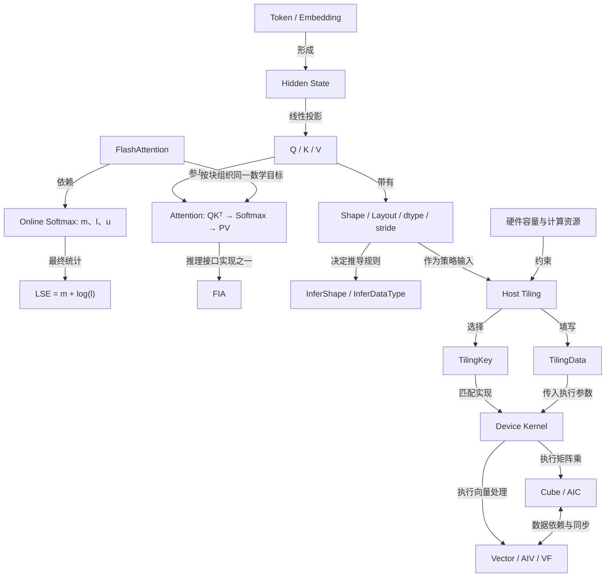
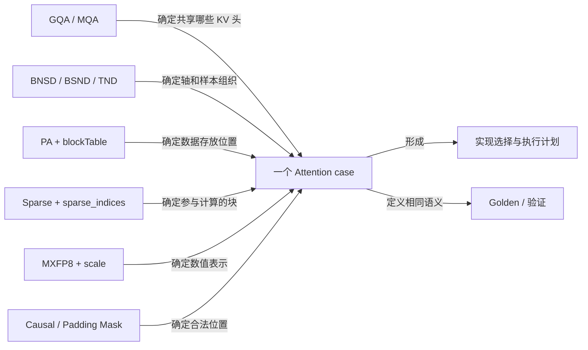

# 概念之间的关联

[概念目录](README.md) · [全部术语](index.md)

箭头写明关系，不把“使用”“实现”“输入输出”“前置知识”混成同一种上下级。

## 从模型到硬件

## 同一 case 的不同配置维度

## 最近术语的关系表

| 起点 | 关系 | 终点 | 具体含义 |
|---|---|---|---|
| Shape | 描述大小 | Tensor | 不包含全部轴语义 |
| Layout | 解释轴 | Shape | 同一个长度元组可能按不同语义解释 |
| Layout + stride | 用于计算 | 数据地址 | 连续 BNSD 与 BSND 具有不同偏移式 |
| TND | 需要样本边界 | cu_seqlens 等 | 总 T 不能唯一反推各样本长度 |
| BNSD / BSND | shape 携带 | 存储 S | 有 padding 时仍需有效长度约定 |
| InferShape | 产生 | 输出形状 | 不计算每个输出值，也不搬动数据 |
| Tiling | 产生 | Data / Key / 启动资源 | 计划、参数和选择标识要分开 |
| TilingKey | 选择 | Kernel 模板 | 同 Key 可以处理不同大小的数据 |
| TilingData | 被读取 | Kernel | 数据结构布局、字段单位必须一致 |
| BNS1 分核 | 划分 | Query 任务 | 同一 Query 内的 S2 分块仍需累计统计 |
| Online Softmax | 维护 | m / l / u | 旧 l 和 u 必须同时换到新最大值基准 |
| expMax | 修正历史 | l / u | 通常是 exp(m_old−m_new)，不是 exp(m_new) |
| LSE | 由统计得到 | m + ln(l) | 归约掉 KV 位置，而非 Query 的 D 轴 |
| LSE 输出布局 | 受约束于 | 接口 | 不能只按 Q 去掉 D 猜轴顺序 |
| StemIndexer | 输出选择 | sparse_indices | 选块在 QBSA 之前；不等于最终 Attention |
| sparse_indices | 映射到 | 逻辑 KV 块 | 还需 PA 页表才能得到物理页 |
| MXFP8 | 用于 | 数值压缩 | Quant group 与 tile/page/sparse block 不同 |
| VF | 运行于相关向量路径 | Vector | 函数与硬件不属同层概念 |
| Cube / Vector | 协同执行 | Kernel | 计算、搬运与等待共同影响时间 |
| Profiling | 提供证据 | 瓶颈判断 | 源码中的 Wait 只说明依赖存在 |

## PA 与稀疏化的连续阅读路径

[KV Cache](02-model/transformer-and-inference.md) → [分页与 blockTable](07-features/paging-sparsity.md#paged-attention) → [稀疏选块与重新归一化](07-features/paging-sparsity.md#sparse-attention) → [组合寻址](07-features/paging-sparsity.md#sparse-pa)。

| 起点 | 关系 | 终点 | 具体含义 |
|---|---|---|---|
| Decode | 追加新 token 的 K/V | KV Cache | 有效长度增长，页满后可继续分配新页 |
| PA 页表 | 保持逻辑顺序并映射 | 物理存储 | 物理页可以不连续，不改变目标 Attention 公式 |
| 稀疏选块 | 限定本次参与集合 | Softmax / PV | 对选中的有效位置归一化，通常改变相对稠密目标的输出 |
| 某个 Query 跳过 KV | 不等同于删除 | KV Cache | 其他 Query 仍可能使用同一份 K/V |

## 用四个反例检查是否理解

1. 把输入标签从 TND 改成 BNSD，数据不会自动重新排列。
2. PA 把 KV 放在不同物理页，不会自动减少参与 Attention 的位置。
3. 所有 tile 各自 Softmax 后拼接，总和不再必然为 1。
4. 某计算单元在等，并不说明它本身算得慢，可能是在等数据或同步。

复习顺序：[布局](04-layout/layout.md) → [形状推导](06-implementation/InferShape.md) → [Tiling](06-implementation/Tiling.md) → [硬件](05-hardware/ascend.md) → [在线 Softmax](03-attention/online-softmax.md) → [综合案例](08-validation/layout-case.md)。
